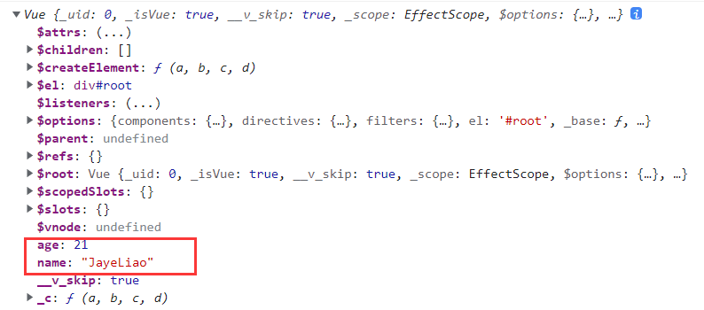

# **Vue**

## **Vue核心**

### 初识**Vue**

1. 想要Vue工作，就必须创建一个Vue实例，且要传入一个配置对象
2. root容器里面的代码依然符合html规范，只不过混入了一些特殊语法
3. root容器里面的代码被称为Vue模板
4. Vue实例和容器一一对应
5. 真实开发中只有一个Vue实例，配合着组件一起使用。
6. {{XXX}}中的XXX写js表达式，并且XXX可以读取到data中的所有属性
7. 一旦data中的数据发生改变，页面中用到该数据的地方也会自动更新

```html

<!--准备好一个容器-->
<div id="root">
    <h1>Hi,I'm {{name}}</h1>
</div>
<script type="text/javascript">
    Vue.config.productionTip = false    //阻止Vue启动时生成生产提示。
    
    // 创建vue实例
    new Vue({
        el:'#root', //el用于指定当前vue实例为哪个容器服务，值通常为css选择器字符串
        data:{  //data中用于1存储当前数据，数据供el所指定的容器去使用，致我们暂时写成一个对象。
            name:'JayeLiao'
        }
    })
</script>
```


### Vue**模板语法**

Vue模板语法分为插值语法和指令语法


#### **插值语法**

作用：用于解析标签体内容

写法：{{XXX}}，xxx是js表达式，且可以直接读取到data中的所有属性


#### **指令语法**

作用：用于解析标签（包括但不限于 标签属性、标签体内容、绑定事件）

举例：v-bind:href=“XXX” 或简写为:href=“XXX”，XXX同样要写js表达式，且可以读取到data中的所有属性。

> Vue中有很多指令，形式都是v-XXX,这里拿v-bind举例

```html
<body>
<div id="root">
    <h1>插值语法</h1>
    <h3>{{name}}</h3>
    <hr>
    <h1>指令语法</h1>
    <a v-bind:href="school.url">点我去{{school.name}}</a>
    <a :href="school.url.toUpperCase()">我的链接变大写了</a>
</div>
<script>
    Vue.config.productionTip = false;

    new Vue({
        el:'#root',
        data: {
            name: 'jaye',
            school: {
                name:'cqust',
                url:'https://www.cqust.edu.cn/'
            }
        }
    })
</script>
</body>
```


### **数据绑定**

Vue中有两种数据绑定方式

- 单向绑定（v-bind）：数据只能从data流向页面。
- 双向绑定（v-model）：数据不仅能从data流向页面，还可以从页面流向data。
  - 双向绑定一般都应用在表单类元素上
  - v-model：value 可以简写为v-model，因为v-model默认收集的是value值。

```html
<body>
<div id="root">
    <!--单向数据绑定-->
    <input type="text" v-bind:value="name">
    <!--双向数据绑定-->
    <input type="text" v-model:value="name">

    <!--简写-->
    <input type="text" :value="name">
    <input type="text" v-model="name">

    <!--下面的代码是错误的 v-mode只能应用在表单类元素上-->
    <h2 v-model:x="name">hello</h2>
</div>
<script>
    new Vue({
        el:'#root',
        data:{
            name:'jayeLiao'
        }
    })
</script>
</body>
```


### **el于data的两种写法**

- el有2种写法

  - new Vue时候配置el属性
  - 先创建Vue实例， 随后通过vm.$mount('#root')指定el的值。

- data的两种写法

  - 对象式

  - 函数式

    > 学习组件时，data必须使用
    >
    > 函数式，否则会报错。

> 由Vue管理的函数，一定不要使用箭头函数，一旦写了箭头函数，this就不再是Vue实例了。


### **MVVM模型**

M：模型（Model）：data中的数据

V：视图（View）：模板代码

VM：视图模型（ViewModel）：Vue实例


- data种所有的属性，最后都出现在vm身上

- vm身上所有的属性 及Vue原型上的所有属性，在Vue模板种都可以直接使用



```html
<body>
<div id="root">
    <h1>{{name}}</h1>
    <h2>{{age}}</h2>
    <h2>{{$el}}</h2>
    <h2>{{_c}}</h2>
    <h2>{{$mount}}</h2>
</div>
<script>
    const vm = new Vue({
        el:'#root',
        data:{
            name:'JayeLiao',
            age:21
        }
    })
    console.log(vm)
</script>
</body>
```


### **数据代理**

#### **回顾Object.defineProperty方法**

```javascript
let person = {
        name: 'jayeLiao',
        sex:'male'
    }
    Object.defineProperty(person, 'age', {
        //value:21,           //属性的值
        //enumerable: true,   //属性是否可以被枚举
        //writable: true,     //属性是否可以修改值
        //configurable: true,  //属性是否可以被删除

        //当有人读取person的age属性时， get函数（getter）就会被调用， 且返回值就是age的值
        get() {
            console.log('有人读取了age属性')
            return 21s;
        },

        //当有人修改person的age属性时，set函数（setter）就会被调用，且会收到修改的具体值
        set(v) {
            console.log('有人修改了age属性的值，值是', v)
        }
    })
```


### **事件处理**

1. 使用`v-on:XXX` 或 `@XXX` 绑定事件，其中XXX是事件名
2. 事件的回调需要配置在methods对象中，最终会在vm上
3. methods中配置的函数，不要用箭头函数，否者this就不是vm了
4. methods中配置的函数，都是被Vue所管理的函数，this的指向是vm 或 组件实例对象
5. `@click="demo"` 和 `@click=“demo($event)”`效果一致，但后者可以传参

```html
<body>
<div id="root">
    <h1>hello,{{name}}</h1>
    <button v-on:click="showInfo1">点我提示信息1（不传参）</button>
    //简写
    <button @click="showInfo2($event, 66)">点我提示信息2（传参）</button>
</div>
<script>
    const vm = new Vue({
        el:'#root',
        data:{
            name:'JayeLiao'
        },
        methods:{
            showInfo1(){
                console.log('hello hello')
            },
            showInfo2(t, num){
                console.log(t)
                console.log(num)
            }
        }
    })
</script>
</body>
```


### **事件修饰符**

1. prevent：阻止默认事件
2. stop：阻止事件冒泡
3. once：事件只触发一次
4. capture：使用事件的捕获模式
5. self：只有event.target是当前操作的元素时才触发事件
6. passive：事件的默认行为立即执行，无需等待事件回调执行完毕

```html
<!DOCTYPE html>
<html lang="en">
<head>
    <meta charset="UTF-8">
    <title>Title</title>
    <script src="../js/vue.js"></script>
    <style>
        *{
            margin-top: 20px;
        }
        .demo1{
            height: 50px;
            background-color: skyblue;
        }
        .box1{
            padding: 5px;
            background-color: skyblue;
        }
        .box2{
            padding: 5px;
            background-color: orange;
        }
    </style>
</head>
<body>
    <div id="root">
        <h2>hellow {{name}}</h2>

<!--         阻止默认行为-->
        <a href="https://www.strongforu.top" @click.prevent="showInfo">点我去另一个地方</a>

<!--        阻止事件冒泡-->
        <div class="demo1" @click="showInfo">
            <button @click.stop="showInfo">点我提示信息</button>
        </div>

<!--        事件只触发一次-->
        <button @click.once="showInfo">click me</button>

<!--        使用事件捕获模式-->
        <div class="box1" @click.capture="showMsg(1)">
            div1
            <div class="box2" @click="showMsg(2)">
                div2
            </div>
        </div>

<!--        只有event.traget是当前操作的元素时才会触发事件-->
        <div class="demo1" @click.self="showInfo2">
            <button @click="showInfo2">点我提示信息</button>
        </div>
    </div>
    <script>
        const vm = new Vue({
            el:'#root',
            data:{
                name:'JayeLiao'
            },
            methods:{
                showInfo(){
                    alert('hello hello')
                },
                showMsg(msg){
                    console.log(msg)
                },
                showInfo2(event){
                    console.log(event.target)
                }
            }
        })
    </script>
</body>
</html>
```

