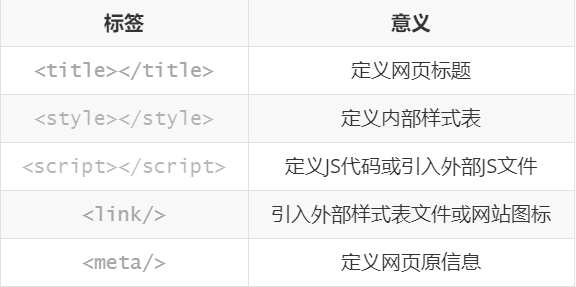

#  前端学习

## HTTP协议

### 四大特性：

1. 基于请求响应

2. 基于TCP/IP作用于应用层之上的协议

3. 无状态

   - 不保存用户的信息

     eg：一个人来了一千次你都记不住，每次当他如初见
     由于http协议是无状态的，所以后续出现一些专门用来记录用户状态的技术（cookie、session...）
   
4. 无/短链接

   - 请求来一次我响应一次，之后我们两个就没有任何链接和关系了
   - 长连接：双方建立链接之后默认不断开（websoket）


### 不同格式：

#### 请求数据格式：

- 请求首行（标识http协议版本，当前请求方式）
- 请求头（一大堆k、v键值对）
- （这里有\n \r不能省略）
- 请求体（并不是所有的请求方式都有get没有post，有的存放的是post请求提交的敏感数据。）

##### 请求方式：

- get请求
  - 朝服务器要数据
    eg：输入网址获取对应内容
- post请求
  - 朝服务端提交数据
    eg：用户登录、输入用户名和密码后提交到服务器后端做身份校验。
  
  

#### 响应数据格式：

- 响应首行（标识http协议版本，响应状态码）
- 响应头（一大堆k、v键值对）
- （这里有\n \r不能省略）
- 响应体（返回给浏览器展示给用户看的数据）


### 响应状态码：

用一串简单的数字来表示一些复杂的状态或者描述状态。

- 1xx：服务端已经成功接受到了你的数据正在出来，你可以继续提交额外的数据。
- 2xx：服务器成功响应了你想要的数据（200 ok请求成功）。
- 3xx：重定向（当你在访问一个登录之后才能看到的页面，你会发现自动跳转到的登录页面）
- 4xx：请求错误
  - 404：请求资源不存在
  - 403：当前请求不合法或者不符合访问资源的条件
- 5xx：服务器内部错误（500）

---

  ## HTML

### 简介：

> 超文本标记语言
>
> 如果你想要让浏览器渲染出你写的页面，你就必须遵循HTML语法
>
> 我们浏览器页面看到的内部都是HTML代码（所有的网站内部都是html代码）

html就是一套书写网页的标准


### 注释：注释是代码之母

- <!--单行注释-->

- <!--  多行注释

  ​		多行注释

  -->

>由于html代码非常的杂乱无章并且很多，所以我们习惯用注释来划定区域方便后续查找。
>
><!--导航条开始-->
>
>导航条所有html代码
>
><!--导航条结束-->
>
><!--左侧菜单栏代码-->
>
>左侧菜单栏的html代码
>
><!--左侧菜单栏结束-->


### HTML文档结构

```html
<html>
    <head>	<!--head内的标签不是给用户看的，而是定义一些配置主要是给浏览器看-->
    </head>
    <body>	<!--body内的标签写什么浏览器就渲染什么 用户就能看到什么-->
    </body>
</html>
```


### **行内标签与块标签**

**块元素：**div, h1-h6, p, ul, li, ol, dl, dt, dd, header, nav, footer, section, article, aside

**行内元素：**a, span, strong, em, mark, img, time


#### **行内元素特征**：

- 内容撑开宽高

  宽高的值都是auto，只不过显出来的宽高都是由内容撑开的

- 不支持设置宽高

- 不支持上下margin与上下padding（左右支持）

  上下的padding都是有问题，谁染把背影撑出来了，这个只是个表面现象，他不会对其他元素有影响

- 所有的行内元素都会在一行显示

- 代码换行会被解析成一个空格


#### **块元素的特征**：

- 默认独占一行
- 没有给宽高的时候，宽高是auto，撑满一行（宽度就是父级的宽度）
- 支持所有的css命令


#### **元素类型的转换**

块元素转行内元素：	display:inline

​	转换后款元素就具有了行内元素的特征（只是显示为行内元素，本身还是块元素）

行内元素转块元素：	display:block

​	转换后行内元素就具有了块元素的特征（只是显示为块元素，本身还是行内元素）


#### **inline-block的特征**

display:inline-block;

特征：

1. 行内元素支持宽高

2. 块元素可以在一行中显示

3. 不给宽高的话，宽度会由内容撑开

4. 代码换行会被解析成一个空格

5. IE6、7不支持inline-block

   IE6、7不认识inline-block，给行内元素加上这个属性后会触发IE的haslayout特点让行内元素具有inline-block一样的特征（被动支持），所以它不支持块元素的inline-block


### **标签嵌套规则**

1. 行内标签不能嵌套块标签，块标签可以嵌套行内标签
2. a标签不能再嵌套a标签
3. h1--h6，dt这些标签的性质是标题，里面不能嵌套块级标签（可以嵌套行内标签）
4. p标签不能嵌套块标签（可以嵌套行内标签）
5. ul和li，以及ol与li，以及dl和dt、dd他们是固定的嵌套规则
   1. ul和ol下边只能跟li，li的父级只能是ul和ol
   2. li中可以嵌套任何标签，甚至可以再放一个ul或者ol
   3. dl和dt、dd可以参考ul和li


### 标签的分类

1. 双标签
2. 单标签（自闭和标签）


### head内常用标签



###  body内常用标签

#### 基本标签

```html
<h1></h1>		标题标签h1 -- h6（<h2></h2>...)
<b>加粗</b>			
<i>斜体</i>
<u>下划线</u>
<s>删除线</s>


<p>
    富强、民主、文明、和谐
    自由、平等、公正、法制			<p></p>段落标签
</p>
<br>		换行
<hr>		水平分割线
```


#### 标签的分类

1. 块级标签：独占一行

   h1--h6	p

   - 块级标签可以修改长宽，行内标签不行
   - 块级标签内部可以嵌套块级标签和行内标签
   - 特例：p标签虽然是块级标签但是它只能嵌套行内标签 不能嵌套块级标签

   总结：只要是块级标签都可嵌套任意的块级标签和行内标签

   ​			但是p标签只能嵌套行内标签

2. 行内标签：自身文本多大就占多大

   i	u	s	b

   - 行内标签不能嵌套块级标签
   - 可以嵌套行内标签


#### 特殊符号

|  符号   |  含义  |
| :-----: | :----: |
| &nbsp ; |  空格  |
|  &gt ;  |  &gt;  |
|  &lt ;  |  &lt;  |
| &amp ;  | &amp;  |
| &yen ;  | &yen;  |
| &copy ; | &copy; |
| &reg ;  | &reg;  |


#### 常用标签

>div		块级标签
>
>span	行内标签
>
>上述两个标签是在构造页面初期时最长实用的，页面布局一般用div和span占位后再去调整样式，尤其是div使用非常频繁。
>
>div你可以把它看成是一块区域 也就意味着用div提前规定所有的区域之后往该区域内部填写内容即可。
>
>而普通的文本先用span标签。


### img标签

```html

```

#### src:

- 图片的路径 可以是本地的也可以是网上的

- url 自动朝该url发送get请求数据

#### alt：

- 当图片加载不出来的时候 给图片的描述信息

#### title:

- 当鼠标悬浮到图片上面的时候自动展示的悬浮信息

#### height：

- 调整图片的高

#### width：

- 调整图片宽度

高度和宽度只修改一个的时候 另一个参数会等比例缩放
如果你修改了两个参数 并且没有考虑比例的问题 那么图片就会失真


### a标签

```html
<a href="" target=""></a>
```

#### href:

- 放url，用户点击就会跳转到该url页面
- 放其它标签的id值，点击跳转到该标签

#### target：

- _self:a标签默认，在当前也跳转
- _blank:新建页面跳转

#### a标签锚点功能：

​	eg:点击一个文本标题，自动跳转到标题对应内容。

```html
<a href="" id="d1">顶部</a>
<div style="height:1000px;background-color:red">
</div>
<a href="" id="d2">中间</a>
<div style="height:1000px;background-color:blue">
</div>
<a href="#d1">回到顶部</a>
<a href="#d2">回到中间</a>
```

当a标签指定的网址从来没有被点击过 那么标签字体颜色就是蓝色，如果点击过了就会是紫色。


### 列表标签

- 无序列表

  ```html
  <ul type="disc">
      <li>first</li>
      <li>second</li>
      <li>third</li>
  </ul>
  ```

  **type属性：**

  - disc（实心圆点，默认值）
  - circle（空心圆圈）
  - square（实心方块）
  - none（无样式

- 有序列表

  ```html
  <ol type="1" start="5">
      <li>1</li>
      <li>2</li>
      <li>3</li>
  </ol>
  ```

  **type属性：**

  - 1 数字列表，默认值
  - A 大写字母
  - a 小写字母
  - Ⅰ大写罗马
  - ⅰ小写罗马

- 标题列表

  ```html
  <dl>
      <dt>标题1</dt>
      <dd>内容1</dd>
      <dt>标题2</dt>
      <dd>内容</dd>
      <dt>标题3</dt>
      <dd>内容3</dd>
  </dl>
  ```


### 表格标签

```html
jason	123	lkhkl
egon	123	ljklj
tank	123	lkjlk
<table border="" cellpadding="" cellspacing="">
    <thead>
        <tr>	一个t人就是一行
            <th>username</th>	加粗
            <th>password</th>	
            <th>hoby</th>
        </tr>
    </thead> 表头(字段信息)
    <tbody>
        <tr>
            <td rowspan="">jason</td>正常文本
            <td>12213</td>
            <td>read</td>
        </tr>
        <tr>
            <td colspan="">egon</td>
            <td>122</dt>
            <td>djb</td>
        </tr>
    </tbody>	表单(数据信息)
</table>
```

**属性：**

- border:表格边框
- cellpadding：内边距
- cellspacing：外边距
- width：像素 百分比（最好通过css来设置长款）
- colspan：水平方向占多行
- rowspan：垂直方向占多行

原生表格标签很丑，后续一般使用框架封装好的。


### 表单标签

**能够获取前端用户数据（用户输入的、用户选择、用户上传。。）**

**包含input等系列标签**

```html
<!--写一个注册功能-->
<form action="">
    <lable for="d1">
    username<input type="text" id="d1">
    </lable>
    <lable for="d2"></lable>
    <input type="text" id="d2">
    <input type="submit">
</form>
<!--在form标签内部书写的用户数据都会被提交到后端-->
```


#### action:

**控制数据提交的后端路径（给哪个服务端提交）**

1. 什么都不写，默认就是朝当前页面所在的url提交数据
2. 写全路径：http://www.baidu.com 朝百度服务端提交
3. 只写路径后缀action='/index/‘
   自动识别出当前服务端的ip和port拼接到前面
   host:port/index/


### input标签：

**通过type属性变形**


**能够出发form表单提交数据的按钮有哪些：**

1. &lt;input type="submit"&gt;
2. &lt;button&gt;点我&lt;/button&gt;

**所有获取用户输入的标签都应该有name属性**
name类似于字典的key
用户的数据就类似于字典的value

属性说明：

- name:表单提交时的”健“，注意和id区别
- vlaue：表单提交时对应项的值
  - type="button", "reset", "submit"时，为按钮上显示的文本年内容
  - type="text","password","hidden"时，为输入框的初始值
  - type="checkbox", "radio", "file"，为输入相关联的值
- checked：radio和checkbook默认被选中的项
- readonly：text和password设置只读
- disabled：所有input均适用


### select标签

```html
<form action="" method="post">
  <select name="city" id="city">
    <option value="1">北京</option>
    <option selected="selected" value="2">上海</option>
    <option value="3">广州</option>
  </select>
  <select name="" id="">
      <optgroup label="重庆">
          <option value="">南岸</option>
          <option value="">江北</option>
      </optgroup>
    </select>
</form>
```

**属性说明：**

- multiple：布尔属性，设置的后为多选，否则默认单选
- disabled：禁用
- selected：默认选中该项
- value：定义提交时选项值


### textarea多行文本

```htm
<textarea name="memo" id="memo" cols="30" rows="10">
  默认内容
</textarea>
```

**属性说明：**

- name：名称
- rows：行数
- cols：列数
- disabled：禁用

---


### 标签具有的两个重要属性

1. id值：

   类似于标签的身份证号 在同一个html页面上id值不能重复。

2. class值：

   该值有点类似于面向对象里面的继承 一个标签可以继承多个class值。

标签既可以有自带的属性 也可以有自定义的属性

---


## 验证form表单提交数据

```python
#python
from flask import Flask,request

app = Flask(__name__)

@app.route('/index/',methods=['GET','POST']) #当前url既支持post也支持post
def index():
    print(request.form)
    print(request.files)
    
    file_obj = request.files.get("myfile")
    file_obj.save(file_obj.name)
    
    return "ok"
    
app.run()
```

```html
<!--html-->
<!DOCTYPE html>
<html lang="en">
<head>
    <meta charset="UTF-8">
    <title>Title</title>
</head>
<body>
<h1>注册页面</h1>
<form action="http://127.0.0.1:5000/index" method="post" enctype="multipart/form-data">
    <p><label for="d1">
        username:<input type="text" id="d1" name="username">
    </label></p>
    <p>
        <label for="d2">
            password:<input type="password" id="d2" name="password">
        </label>
    </p>
    <p>
        <label for="d3">
            birthday:<input type="date" id="d3">
        </label>
    </p>
    <p>
        <label for="g1">
            <input id="g1" type="checkbox" name="gender">男
        </label>
        <label for="g2">
            <input type="checkbox" id="g2" name="gender">女
        </label>
    </p>
    <p>
        <input type="file" name="myfile">
    </p>
    <input type="submit">
</form>
</body>
</html>
```

> form表单默认提交数据的方式 是get请求  数据是直接放在url后面的
>
> http://127.0.0.1:5000/index/?username=sdadasdsda&gender=on
> 你可以通过method指定提交方式
>
> form表单提交文件需要注意
> 	1.method必须是post
> 	2.enctype="multipart/form-data"
> 		enctype类似于数据提交的编码格式
> 			默认是urlencoded 只能够提交普通的文本数据
> 			formdata 就可以支持提交文件数据

---

## CSS

层叠样式表，给html标签添加样式，让它更加好看。

### 注释

```css
/*单行注释*/

/*多行注释
多行注释
多行注释*/
```

通常我们在写css样式的时候也会用注释来划定样式区域。


### css语法结构

选择器{属性1:值1;
			 属性2:值2;
			 属性3:值3;}


### css三种引入方式

1. style标签直接书写

   ```html
   <style>
       h1{
           color:red;
       }
   </style>
   ```

2. link变迁引入外部css文件（最正规方式,解耦合）

   ```html
   <link rel="stylesheet" href="mycss.css">
   ```

3. 行内式(一般不用)

   ```html
   <h1 style="color:green">
       Hello,world.
   </h1>
   ```

### css学习流程

1. 如何查早标签
2. 之后在学如何添加样式


### css选择器

#### 基本选择器

```html
<div id="d1" class="c1 c2">
        <p>div里面的p</p>
        <span>div里面的span</span>
    </div>
    <p id="d2" class="c1 c2">ppp</p>
        <span id="d3" class="c2">span111</span>
        <span id="d4" class="c3">span222</span>
```

1. id选择器

   ```html
   <style>
           /*id选择器*/
           #d1{/*找到id为i一的标签，将文本颜色改为绿黄色*/
               color: greenyellow;
           }
       </style>
   ```

2. 类选择器

   ```html
   <style>
           /*类选择器*/
           .c1{/*找到class值里面包含c1的标签*/
               color: red;
           }
   ```

3. 标签/元素选择器

   ```html
   <style>
           /*标签选择器*/
           span { /*找到所有span标签*/
               color: yellow;
           }
       </style>
   ```


#### 组合选择器

```html
<div>
        <p>div p</p>
        <p>
            div p
            <span>div p span</span>
        </p>
        <span>span</span>
        <span>span</span>
    </div>
    <span>span</span>
    <span>span</span>
div 里面的p span 都是div的后代
p是div的儿子
p里面的span是p的儿子 是div的孙子
div是p的父亲
```


1. 后代选择器

   ```html
   <style>
           /*后代选择器*/
           div span{
               color: red;
           }
       </style>
   ```

2. 儿子选择器

   ```html
   <style>
   div>span{
               color: red;
           }
       </style>
   ```

3. 毗邻选择器

   ```html
   <style>
   div+span{
               color: red;
           }
       </style>
   div紧挨着的下一个span变颜色
   ```

4. 弟弟选择器

   ```html
   <style>
   div~span{
               color: red;
           }
       </style>
   同级别下面所有的span变颜色
   ```


#### 属性选择器

以[]起手作为标志

```html
<body>
    <input type="text" username>
    <input type="text" username="jason">
    <input type="text" username="egon">
    <p username="tank"> 水箱老师</p>
    <div username="egon"> egon老师</>
</body>
```

1. 含有某个属性

   ```html
   <style>
          [username]{/*将所有含有属性名是username的标签背景颜色改为红色*/
               background-color: red;
           }
       </style>
   ```

2. 含有某个属性并且有某个值

   ```html
   <style>
           [username="jason"]{/*找到所有属性名是username并且值为jason的*/
              background-color:orange;
           }
       </style>
   ```

3. 含有某个属性并且有某个值某个标签

   ```html
   <style>
           input[username="egon"]{/*找到所有属性名是username并且属性值是egon的input标签*/
               background-color: green;
           }
       </style>
   ```


#### 伪类选择器

```html
<!DOCTYPE html>
<html lang="en">
<head>
    <meta charset="UTF-8">
    <title>Title</title>
    <style>
        a:link{
            color: red;
        }
        a:hover{
            color: aqua;/*鼠标悬浮*/
        }
        a:active{
            color: black;/*点击不松开的状态*/
        }
        a:visited{
            color: blue;/*访问之后的状态*/
        }
        input:focus{
            background-color: red;
        }
    </style>
</head>
<body>
<a href="https://www.bilibili.com">小轩在不在</a>
<input type="text">
</body>
</html>
```


#### 伪元素选择器

```html
<!DOCTYPE html>
<html lang="en">
<head>
    <meta charset="UTF-8">
    <title>Title</title>
    <style>
        p:first-letter{/*第一个字*/
            font-size: 48px;
            color: orange;
        }
        p:before{/*在文本开头用css添加类容*/
            content: '你说得对';
            color: blue;
        }
        p:after{/*在文本末尾用css添加类容*/
            content: '雨露均沾';
            color: orange;
        }
    </style>
</head>
<body>
<p>
    127.0.0.1 - - [17/Jul/2021 23:02:17] "POST /index HTTP/1.1" 308 -
</p>
</body>
</html>
```

**before和after通常是用来清楚浮动带来的影响：父标签塌陷的问题**


### 分组与嵌套

```html
<!DOCTYPE html>
<html lang="en">
<head>
    <meta charset="UTF-8">
    <title>Title</title>
    <style>
        #d1,.c1{/*逗号表示并列关系*/
            color: red;
        }
        
        /*
         #d1 .c2 #d3{空格嵌套关系
            color: red;
        }
        */

    </style>
</head>
<body>
    <div id="d1">div
        <p class="c2">div>p
            <span id="d3">div>p>span1</span>
            <span id="d4">div>p>span2</span>
        </p>
        <p class="c3">
            ksljflksjflk
        </p>
    </div>
    <p class="c1">p</p>
    <span>span</span>

</body>
</html>
```


### 选择器优先级

1. 选择器相同,书写顺序不同
          就近原则:谁离得近听谁的

2. 选择器不同
           行类选择器 > id选择器 > 类选择器 > 标签选择器


### css属性相关

#### 设置长宽

```html
<style>
        p {
            background-color: red;
            height: 200px;
            width: 400px;
        }
        span {
            background-color: aqua;
            height: 200px;
            width: 400px;
            /*行内标签无法设置长宽写了也不会生效*/
        }
    </style>
```

#### 字体属性

```html
 <style>
        p{
            font-family: "Microsoft Sans Serif";
            font-size: 24px;/*字体大小*/
            font-weight: bolder;/*bolder lighter 100-900 inherit 继承父元素的粗细值*/
            /*color: red;!*颜色英文*!*/
            /*color: #eeeeee;!*颜色编号*!*/
            /*color: rgb(129,23,45);!*三基色 数字 0-255*!*/
            color: rgba(128,23,45,0.9);/*第四个参数颜色透明度 范围0-1*/
            
        }
```

#### 文字属性

##### 文字对齐

```html
<style>
        p{
            /*text-align: center;居中*/
            /*text-align: right;右对齐*/
            /*text-align: left;左对齐*/
            /*text-align: justify;两端对齐*/
        }
    </style>
```

##### 文字装饰

```html
 <style>
        /*p{*/
        /*    !*text-align: center;居中*!*/
        /*    !*text-align: right;右对齐*!*/
        /*    !*text-align: left;左对齐*!*/
        /*    !*text-align: justify;两端对齐*!*/
        /*    */
        /*}*/
        p{
            /*text-decoration: underline;下划线*/
            /*text-decoration: overline;上划线线*/
            /*text-decoration: line-through;删除线*/
            font-size: 16px;
            text-indent: 32px;/*缩进32px*/
        }
        a{
            text-decoration: none; /*給a标签去掉自带的下滑线*/
        }

    </style>
```

#### 背景属性

```html
<style>
        div{
            height:400px;
            width: 400px;
            /*background-color: red;!*背景色*!*/
            /*background-image: url("222.png");!*默认全部铺满*!*/
            /*background-repeat: no-repeat;!*不平铺*!*/
            /*background-repeat: repeat-x;!*水平方向上平铺*!*/
            /*background-repeat: repeat-y;!*垂直方向上平铺*!*/
            /*其实浏览器不是一个平面 是一个三维立体结构
               z轴指向用户 越大离用户越近
             */
            /*background-position: center center;!*第一个左 第二个上*!*/

            /* 如果出现多个属性名前缀是一样的情况 一般可以简写 只写前缀*/
            background: url("222.png") blue no-repeat center center;/*位置随意,参数个数也随意*/
            background-attacment: fixed;/*不晓得怎么描述，忘了再研究吧*/
        }
    </style>
```

#### 边框

```html
<style>
        p{
            background-color: red;
            border-width: 5px;
            border-style: solid;
            border-color: green;

            ;
        }
        div{
            /*border-left-width: 5px;*/
            /*border-left-color: red;*/
            /*border-left-style: dotted;*/

            /*border-right-width: 10px;*/
            /*border-right-color: greenyellow;*/
            /*border-right-style: solid;*/

            /*border-top-width: 15px;*/
            /*border-top-color: deeppink;*/
            /*border-top-style: dashed;*/

            /*border-bottom-width: 10px;*/
            /*border-bottom-color: tomato;*/
            /*border-bottom-style: solid;*/
            border: 3px solid red;
        }
        #d1{
            background-color: greenyellow;
            height: 400px;
            width: 400px;
            border-radius: 50%;/*直接写50%即可,长款一样就是圆,不一样就是椭圆*/
        }
    </style>
```

#### dispaly属性

```html
<style>
        /*#d1{*/
        /*    !*display: none;!*隐藏标签不展示到前端页面,但还存在与文档上,原来的位置也不再占有*!*!*/
        /*    width: 100px;*/
        /*    height: 100px;*/
        /*    background-color: red;*/
        /*    display: inline;!*将标签设置为行内标签的特点*!*/
        /*}*/

        /*#d2{*/
        /*    width: 100px;*/
        /*    height: 100px;*/
        /*    background-color: greenyellow;*/
        /*    display: inline;*/
        /*}*/

        #c1{
            height: 100px;
            width: 100px;
            background-color: red;
            display: block;/*将标签设置成块级标签的特点*/
        }

        #c2{
            height: 100px;
            width: 100px;
            background-color:greenyellow;
            display: block;
        }

        #d1{
            height: 100px;
            width: 100px;
            background-color:greenyellow;
            display: inline-block;/*设置标签在一行显示又可以设置长宽*/
        }

        #d2{
            height: 100px;
            width: 100px;
            background-color:red;
            display: inline-block;
        }
    </style>
```


### 盒子模型

- 盒子与盒子的距离（标签与标签之间的距离 margin 外边距）
- 盒子的厚度（标签的边框 border）
- 盒子里面的物体到盒子的距离（内容到边框的距离 padding 内边距）
- 物体的大小（内容 content）


**如果想要调整标签与标签的距离 可以调整margin**

**浏览器会自带8px的margin，一般情况下我们会**
**body的margin改为0**

```html
<!DOCTYPE html>
<html lang="en">
<head>
    <meta charset="UTF-8">
    <title>Title</title>
    <style>
        body{
            margin: 0;
            /*margin: 10px 20px;!*上下10 左右20*!*/
            /*margin:10px 20px 30px;!*上10 左右20 下30*!*/
            /*margin:10px 20px 30px 40px;!*上 右 下 左*!*/
        }
        /*p {*/
        /*    margin-bottom: 0;*/
        /*    margin-top: 0;*/
        /*    margin-left: 0;*/
        /*    margin-right: 0;*/
        /*}*/
        #d1 {
            margin-bottom:20px;
        }
        #d2 {
            margin-top: 50px;/*取大 不叠加*/
        }
        #dd {
            margin: 0 auto;/*只能做到标签的水平居中*/
        }
        p {
            /*border: 3px solid red;*/
            /*padding-left:10px ;*/
            /*padding-top: 20px;*/
            /*padding-right:20px ;*/
            /*padding-bottom: 50px;*/

            padding:10px 20px 30px 50px;/*规律和margin一模一样*/
        }
    </style>
</head>
<body>
<!--<p style="border: 1px solid red" id="d1">ppp</p>-->
<!--<p style="border: 1px solid orange" id="d2">ppp</p>-->
    
<!--<div style="border: 3px solid red; height:400px; width:400px;">-->
<!--    <div style="border: 1px solid orange; height: 50px; width: 50px;background-color: blue;" id="dd"></div>-->
    
<!--</div>-->
<p>ppp</p>
</body>
</html>
```


### 浮动

---


2022\7\28添加:

#### **定义**

使元素脱离文档流、按照指定方向发生移动，遇到父级的边界或则相邻的浮动元素就会停下来

值：left、right、none

#### **特征**

1. 块元素可以在一行显示
2. 按照一个指定的方向移动，遇到父级的边界或者相邻的浮动元素就会停下来
3. 行内元素支持宽高
4. 脱离文档流
   1. 浮动后跟的元素（没有浮动）的位置是从前面浮动元素的位置开始的
   2. 注意：非浮动元素**里面的内容**会流出前面浮动元素的位置（盒模型的位置）
5. 块元素默认宽度会被改变（包裹性）
   - 块元素不设置宽度，那宽度会自动变成内容所撑开的宽度

6. 父标签塌陷
7. 代码中的换行符不会被解析成空格

#### **脱离文档流**

- 指的是元素不在页面当中占位置了
- 定位是完全脱离文档流
- 浮动不是完全脱离文档流

如果高度不一致的情况下，想让他们按顺序排列就可以选择inline-block


#### **清除浮动的方法**

1. clear

   值：left、right、both

2. 给父级添加高度

   有时候是不能给父级添加高度的 该方法具有局限性

3. inline-block

   这个方法元素没有办法居中

4. overflow:hidden

   如果子级有定位的话，并且这个定位超出了父级的范围，那样就看不到了

5. after伪类清除浮动（最佳实践）

   看下面的解决父标签塌陷中的clearfix:after样式

---


**浮动的元素没有块级一说 本身多大浮起来之后就只能占多大**

**只要是设计到页面的布局一般都是用浮动提前规划好的**

```html
<!DOCTYPE html>
<html lang="en">
<head>
    <meta charset="UTF-8">
    <title>Title</title>
    <style>
        body{
            margin: 0;
        }
        #d1 {
            height: 200px;
            width:200px;
            background-color: red;
            float: left;/*浮动 左飘*/
        }
        #d2 {
            height: 200px;
            width:200px;
            background-color: greenyellow;
            float: right;/*浮动 右飘*/
        }
    </style>
</head>
<body>
<div style="width: 50px; height: 50px">111</div>
<div id="d1"></div>
<div id="d2"></div>
</body>
</html>
```

**影响：父标签塌陷**

**解决方案：**

```html
<!DOCTYPE html>
<html lang="en">
<head>
    <meta charset="UTF-8">
    <title>Title</title>
    <style>
        body {
            margin: 0;
        }
        <!--给塌陷标签加上该类-->
        .clearfix:after{
            content: "";
            display: block;
            clear: both;
        }
        #d1 {
            border: 3px solid black;
        }
        #d2 {
            background-color: orange;
            height: 100px;
            width: 100px;
            float: left;
        }
        #d3 {
            background-color: yellowgreen;
            height: 100px;
            width: 100px;
            float: left;
        }
    </style>
</head>
<body>
<div id="d1" class="clearfix">
    <div id="d2"></div>
    <div id="d3"></div>
</div>
</body>
</html>
```


### overflow溢出属性

|   值    | 描述                                                     |
| :-----: | -------------------------------------------------------- |
| visible | 默认值。内容不会被修剪，会呈现在元素框之外。             |
| hidden  | 内容会被修剪，并且其余内容是不可见的。                   |
| scroll  | 内容会被修剪，但是浏览器会显示滚动条以便查看其余的内容。 |
|  auto   | 如果内容被修剪，则浏览器会显示滚动条以便查看其余的内容。 |
| inherit | 规定应该从父元素继承 overflow 属性的值。                 |

- overflow（水平和垂直均设置）
- overflow-x（设置水平方向
- overflow-y（设置垂直方向）

圆形头像实例

```html
<!DOCTYPE HTML>
<html>
<head>
  <meta charset="UTF-8">
  <meta http-equiv="x-ua-compatible" content="IE=edge">
  <meta name="viewport" content="width=device-width, initial-scale=1">
  <title>圆形的头像示例</title>
  <style>
    * {
      margin: 0;
      padding: 0;
      background-color: #eeeeee;
    }
    .header-img {
      width: 150px;
      height: 150px;
      border: 3px solid white;
      border-radius: 50%;
      overflow: hidden;
    }
    .header-img>img {
      width: 100%;
    }
  </style>
</head>
<body>

<div class="header-img">
  
</div>

</body>
</html>
```


### **BFC**

Block Formatting Contexts	块级元素格式化上下文

它决定了**块级元素**如何对它的**内容**进行布局，以及与**其它元素**的关系和**相互作用**

块级元素：父级（是一个块元素）

内容：子元素（是一个块元素）

其他元素：与内容同级别的兄弟元素

相互作用：BFC里面的元素与外面的元素并不会发生影响


触发BFC的方式（以下任意一条就可以）

1. float的值不为none
2. overflow的值不为visible
3. display的值为table-cell、table-caption和inline-block之一
4. position的值不为static或者releative中任何一个


普通文档流的布局规则

- 浮动的元素是不会被父级计算高度
- 非浮动元素会覆盖浮动元素位置
- margin会传递给父级
- 两个相邻的元素上下margin会重叠

BFC的布局规则

- 浮动的元素会被父级计算高度
- 非浮动元素不会覆盖浮动元素位置
- margin不会传递给父级
- 两个相邻的元素上下margin不会重叠


### 定位

#### 静态

所有标签都是静态的static，无法改变位置

#### 相对定位

相对于标签原来的位置做移动relative

移动方向：top、right、bottom、left

特点：

1. 如果只加相对定位，不设置元素移动的位置，元素和之前是没有变化的
2. 根据自己原来的位置计算移动的位置
3. 不脱离文档流，元素移走之后，原来的位置还会被保留
4. 加上相对定位后对原来的元素本身的特征没有影响
5. 提升层级


```html
<!DOCTYPE html>
<html lang="en">
<head>
    <meta charset="UTF-8">
    <title>Title</title>
    <style>
        body {
            margin: 0;
        }
        #d1 {
            width: 100px;
            height: 100px;
            background-color: red;
            position: relative;
            left: 50px;/*从左向又偏离50px*/
            top: 50px;/*丛上到下偏离50px*/
            /*标签由static变为relative它的性质就从原来没有定位的标签变成了已经定位过的标签*/
            /*虽然你哪怕没有动，但是你的性质也已经改变了*/
        }
    </style>
</head>
<body>
<div id="d1"></div>
</body>
</html>
```


#### 绝对定位（absolute）

相对于已经定位过的父标签做移动（如果没有父标签就以body位参照）

```html
<!DOCTYPE html>
<html lang="en">
<head>
    <meta charset="UTF-8">
    <title>Title</title>
    <style>
        body {
            margin: 0;
        }
        #d2 {
            height: 100px;
            width: 200px;
            background-color: red;
            position: relative;/*已经定位过了*/
        }
        #d3 {
            height: 200px;
            width: 400px;
            background-color: yellowgreen;
            position: absolute;
            left: 200px;
            top: 100px;
        }
    </style>
</head>
<body>
    <div id="d2">
        <div id="d3"></div>
    </div>
</body>
</html>
```


当你不知道页面其他标签的位置和参数，只给了你一个父标签的参数，让你基于该标签做定位

#### 固定定位（fixed）

相对于浏览器窗口固定在某个位置

```html
<!DOCTYPE html>
<html lang="en">
<head>
    <meta charset="UTF-8">
    <title>Title</title>
    <style>
        body {
            margin: 0;
        }
        #d4 {
            position: fixed;/*写了fixed之后，定位就是依据与浏览器窗口*/
            bottom: 10px;
            right: 20px;
            height: 50px; 
            width: 100px;
            background-color: white;
            border: 3px solid black;
            text-align: center;
        }
    </style>
</head>
<body>
<div style="height: 500px;background-color: red"></div>
<div style="height: 500px;background-color: greenyellow"></div>
<div style="height: 500px;background-color: blue"></div>
<div id="d4">回到顶部</div>
</body>
</html>
```

ps:浏览器优先展示文本内容，如果发现文本被挡住了，会优先展示文本内容。


### 验证浮动和定位是否脱离文档流（原来位置是否保持）

#### 不脱离文档流

- 相对定位

#### 脱离文档流

- 浮动

- 绝对定位
- 固定定位


### z-index模态框

eg**:百度登录页面**

1. 最底部是正常内容(z=0)
2. 黑色的透明区(z=99)
3. 白色的注册区 离用户最近(z=100)


```htm
<!DOCTYPE html>
<html lang="en">
<head>
    <meta charset="UTF-8">
    <title>Title</title>
    <style>
        body {
            margin: 0;
        }
        .cover {
            position: fixed;
            left: 0;
            right: 0;
            top: 0;
            bottom: 0;
            background-color: rgba(0,0,0,0.5);
            z-index: 99;
        }
        .modal {
            height: 200px;
            width: 400px;
            z-index: 100;
            position: fixed;
            background-color: greenyellow;
            left: 50%;
            top: 50%;
            margin-top: -100px;
            margin-left: -200px;
        }
        .modal h2{
            text-align: center;
            color: red;
        }
        input[value="登录"] {
            width: 50px;
            height: 25px;
            position: relative;
            left: 50%;
            margin-left: -25px;
        }
    </style>
</head>
<body>
    <div>这是最底层内容</div>
    <div class="cover"></div>
    <form action="">
    <div class="modal">
        <h2>登录</h2>
        <p>
            username:<input type="text">
        </p>
        <p>
            password:<input type="password">
        </p>
        <input type="submit" value="登录">
    </div>
        </form>
</body>
</html>
```


### 透明度opacity

**不单单可以修改颜色透明度**
**还可以修改字体透明度**

- rgba只能影响颜色
- opacity可以修改颜色和字体

---

## JavaScript

### JS注释

- 单行注释

  ```javascript
  // 单行注释
  ```

- 多行注释

  ```js
  /*
  多行注释
  多行注释
  多行注释
  */
  ```


### JS引入方式

1. script标签内部直接书写js代码
2. script标签src属性引入外部js代码


### 变量

**在js中 首次定义一个变量名需要用关键字声明**

1. 关键字var

   var name="jason"

2. es6推出新语法

   let name="jason"

3. 变量命名只能是

   ​	数字 字母	下划线  $

4. 命名规范推荐使用驼峰式命名

   ​	userName

   ​	dataOfDb

5. 变量名不能用关键字做变量名

区别：let声明的变量只在该声明的代码块有效


### 数据类型

js是一门拥有动态类型的语言

#### 查看数据类型:

```js
typeof a
typeof b
```

#### 数值类型(number)

没有整型与浮点型的区别

```js
var a = 11;
var b = 11.11;
//查看当前数据类型
```

##### NaN

表示不是一个数字(not a number)


#### 字符类型(string)

```js
var s= 'eimago'
typeof s
//string
var s1 = "eimago"
typeof s1
// string
vat s2 = """eimago"""
//VH665(会报错)
```

##### 模板字符串

```js
var s3 = `
lksjflks
sdfjklsj
sdlfkjkl
`
```

**模板字符串除了可以定义多行文本以外,还可以实现格式化字符串操作**

```js
var name = 'eimago'
var age = 20
var sss = `
my name is ${name} and age is ${age}
`
sss
"
my name is eimago and age is 20
"
```

##### 字符串拼接

```js
var name = 'eimago'
var gae = '20'
name + age;
```

##### 常用方法

|            方法            |        说明        |
| :------------------------: | :----------------: |
|          .length           |      返回长度      |
|          .trim()           |      移除空白      |
|        .trimLeft()         |    移除左边空白    |
|        .trimRight()        |    移除右边空白    |
|         .charAt(n)         |   返回第n个字符    |
|    .concat(value, ...)     |        拼接        |
| .indexOf(substring, start) |     子序列位置     |
|    .substring(from, to)    | 根据索引获取子序列 |
|     .slice(start, end)     |        切片        |
|       .toLowerCase()       |        小写        |
|       .toUpperCase()       |        大写        |
|  .split(delimiter, limit)  |        分割        |


#### 布尔值(boolean)

**js中布尔值全小写true false**

- 布尔值中的false:
  - 空字符串
  - 0
  - null
  - undefined
  - NaN

##### null和undefined

- null

  表示值为空 一般都是指定或者清空一个变量是使用

  name = 'strongforu'
  name = null

- undefined

  表示声明了一个变量 但是还没有做初始化操作(没有给值)
  函数没有指定返回值时返回的也是undefined

#### 类型转换:

parseInt()

ParseFloat()

```js
parsInt('121121')
//121121
parsFloat('11.110')
//11.11
parsInt('11.11')
//11
parsInt('123klsjflf')
//123
parsInt('slkjfksl232jsf')
//NaN
```


### 对象

js一切皆对象

#### 数组

```js
var l = [11,22,33,44]
typeof l
//object
l = [11,'adsadf','11.11',true]
l[1]
adsadf
l[-1]
//不支持负数索引
```

##### 数组常用方法

|        方法        |                    说明                    |
| :----------------: | :----------------------------------------: |
|      .length       |                 数组的大小                 |
|     .push(ele)     |                尾部追加元素                |
|       .pop()       |                获取尾部元素                |
|   .unshift(ele)    |                头部插入原宿                |
|      .shift()      |                头部移除元素                |
| .slice(start, end) |                    切片                    |
|     .reverse()     |                    反转                    |
|     .join(seq)     |           将数组元素连接成字符串           |
| .concat(val, ...)  |                  连接数组                  |
|      .sort()       |                    排序                    |
|     .forEach()     |       将数组的每个元素传递给回调函数       |
|     .splice()      |        删除元素,并向数组添加新元素         |
|       .map()       | 返回一个数组元素调用函数处理后的值的新数组 |


### 运算符

#### 算术运算符

\+	\- 	*	/ 

```js
var x = 10;
var res1 = x++;
var res2 = ++x;

res1;
10
res2;
12
```

#### 比较运算符

\>	>=	<	<=	!=	==	!==	===

**<font color= red >注意:</font>**

> 1 == "1"	//true 弱等于
> 1 === "1"	//false 强等于
>
> 上面这种情况出现的原因在于JS是一门弱类型语言(会自动转换数据类型)，所以当你用两个等号进行比较时，JS内部会自动先将
> 数值类型的1转换成字符串类型的1再进行比较，所以我们以后写JS涉及到比较时尽量用三等号来强制限制类型，防止判断错误.

#### 逻辑运算符

&&	\||	!

#### 赋值运算符

=	+=	-=	*=	/=


### 流程控制

#### if判断

```js
var age = 10;
//if(条件){条件成立之后的代码块}
if (age>18){
    console.log("...");
}else{
    console.log("---");
}

//if-else
if (age>18){
    console.log("...");
}else if (age<24){
    console.log("====");
}else{
    console.log("---");
}

```

#### switch语法

```js
var num = 2;
switch(num){
    case 0:
        console.log("---");
        break;
    case 1:
        console.log("===");
        break;
    default:
        console.log("条件都没匹配上,默认走流程");
}
```

#### for循环

```js
for(let i=0;i<10;i++){
    console.log(i)
}
```

#### while循环

```js
var i = 0;
while(i<100){
    console.log(i);
    i++
}
```

#### 三目运算符

```js
i>2?1:3;
//条件成立取1,不成立取3
```


### 函数

#### 无参函数

```js
function fucn1(){
    console.log('hello world');
}
```

#### 有参函数

```js
function func2(a, b){
    consloe.log(a,b);
}
func2(1,2,3,4,5) //多了没关系 只要对应的数据
//1 2

func2(1) //少了也没关系
//1 undefined
```

#### 关键字arguments

```js
function func2(a,b){
    console.log(arguments);
    console.log(a,b);
}
```

#### 返回值

```js
function index(){
    return 666,777,888;
}
```

只能有一个返回值,多个返回值返回最后一个

#### 匿名函数

```js
function(){
    console.log('hahahah');
}
var res = function(){
    console.log('hahahah');
}
```

#### 箭头函数

箭头左边是形参 右边是返回值

```js
var func1 = v=>v;
```

**等价于**

```js
var func1 = function(v){
    return v;
}
```

**多个形参**

```js
var func2 = (arg1,arg2) => arg1+arg2;
```

#### 函数的全局变量和局部变量

变量的作用域与python的一样

```js
var city = "BeiJing";
function f() {
  var city = "ShangHai";
  function inner(){
    var city = "ShenZhen";
    console.log(city);
  }
  inner();
}

f() //输出ShenZhen
```

```js
var city = "BeiJing";
function Bar() {
  console.log(city);
}
function f() {
  var city = "ShangHai";
  return Bar;
}
var ret = f();
ret();  // 打印结果是BeiJing
```

```js
var city = "BeiJing";
function f(){
    var city = "ShangHai";
    function inner(){
        console.log(city);
    }
    return inner;
}
var ret = f();
ret();	//打印结果是ShangHai
```


### 自定义对象

JavaScript的对象（Object）本质上是键值对的集合（Hash结构），但是只能用字符串作为键。

#### 创建自定义对象

```js
var a = {"name": "Alex", "age": 18};
console.log(a.name);
console.log(a["age"]);
```

#### 遍历对象中的内容

```js
var a = {"name": "Alex", "age": 18};
for (var i in a){
  console.log(i, a[i]);
}
```

#### 另一种方法

````js
var person=new Object();  // 创建一个person对象
person.name="Alex";  // person对象的name属性
person.age=18;  // person对象的age属性
````

### 内置对象

#### Date对象

```js
//方法1：不指定参数
var d1 = new Date();
console.log(d1.toLocaleString());
//方法2：参数为日期字符串
var d2 = new Date("2004/3/20 11:12");
console.log(d2.toLocaleString());
var d3 = new Date("04/03/20 11:12");
console.log(d3.toLocaleString());
//方法3：参数为毫秒数
var d3 = new Date(5000);
console.log(d3.toLocaleString());
console.log(d3.toUTCString());

//方法4：参数为年月日小时分钟秒毫秒
var d4 = new Date(2004,2,20,11,12,0,300);
console.log(d4.toLocaleString());  //毫秒并不直接显示
```

**Date对象的方法:**

```js
var d = new Date(); 
//getDate()                 获取日
//getDay ()                 获取星期
//getMonth ()               获取月（0-11）
//getFullYear ()            获取完整年份
//getYear ()                获取年
//getHours ()               获取小时
//getMinutes ()             获取分钟
//getSeconds ()             获取秒
//getMilliseconds ()        获取毫秒
//getTime ()                返回累计毫秒数(从1970/1/1午夜)
```

### Json对象

**序列化与反序列化**

JSON.stringify()		序列化

JSON.parse()			反序列化


### RegExp对象

```js
// 定义正则表达式两种方式
var reg1 = new RegExp("^[a-zA-Z][a-zA-Z0-9]{5,11}");
var reg2 = /^[a-zA-Z][a-zA-Z0-9]{5,9}$/;

// 正则校验数据
reg1.test('jason666')
reg2.test('jason666')

/*第一个注意事项，正则表达式中不能有空格*/ 

// 全局匹配
var s1 = 'egondsb dsb dsb';
s1.match(/s/)
s1.match(/s/g)
var reg2 = /^[a-zA-Z][a-zA-Z0-9]{5,9}$/g
reg2.test('egondsb');
reg2.test('egondsb');
reg2.lastIndex;
/*第二个注意事项，全局匹配时有一个lastIndex属性*/

// 校验时不传参数
var reg2 = /^[a-zA-Z][a-zA-Z0-9]{5,9}$/
reg2.test();
reg2.test(undefined);

var reg3 = /undefined/;
reg3.test();
```

---

## BOM与DOM操作

BOM
		浏览器对象模型	Browser Object Model
			js代码操作浏览器

DOM
		文档对象模型	Document Object Model
			js代码操作标签

### BOM操作

window对象:浏览器窗口

```js
window.innerHeight  浏览器窗口的高度
900
window.innerWidth   浏览器窗口的宽度
1680

window.open('https://www.mzitu.com/','','height=400px,width=400px,top=400px,left=400px')
# 新建窗口打开页面 第二个参数写空即可 第三个参数写新建的窗口的大小和位置
# 扩展父子页面通信window.opener()  了解

window.close()  关闭当前页面
```


### Window子对象

#### navigator

```js
window.navigator.appName	// Web浏览器全称
"Netscape"
window.navigator.appVersion	// Web浏览器厂商和版本的详细字符串
"5.0 (Macintosh; Intel Mac OS X 10_14_6) AppleWebKit/537.36 (KHTML, like Gecko) Chrome/81.0.4044.138 Safari/537.36"

window.navigator.userAgent		掌握  # 用来表示当前是否是一个浏览器
"Mozilla/5.0 (Macintosh; Intel Mac OS X 10_14_6) AppleWebKit/537.36 (KHTML, like Gecko) Chrome/81.0.4044.138 Safari/537.36"

window.navigator.platform	// 浏览器运行所在的操作系统
"MacIntel"
```

#### screen对象

屏幕对象，不常用。

一些属性：

- screen.availWidth - 可用的屏幕宽度
- screen.availHeight - 可用的屏幕高度

#### history对象

```js
history.forward()  // 前进一页
history.back()  // 后退一页
```

#### location对象

```js
location.href  获取URL
location.href="URL" // 跳转到指定页面
location.reload() 重新加载页面
```


### 弹出框

- 警告框

  ```js
  alert("你不要过来啊！！！")
  ```

- 确认框

  ```js
  confirm("你确定真的要这样做吗？")
  ```

- 提示框

  ```js
  prompt("请出示你的手牌","来宾三位")
  ```


### 计时器相关

- 过一段时间后之后触发

  ```js
  function func1() {
          alert(123)
      }
  let t = setTimeout(func1,3000); 
  ```

- 每隔几秒钟触发一次

  ```js
  function func2() {
          alert(123)
      }
  let t = setInterval(func2,3000)
  ```

- 取消定时任务

  ```js
  clearTimeout(t)      // 取消定时任务  如果你想要清除定时任务 需要使前用变量指代定时任务
  ```

  

```html
<script>
    function func1() {
        alert(123)
    }
    let t = setTimeout(func1,3000);  // 毫秒为单位 3秒之后自动执行func1函数

    clearTimeout(t)      // 取消定时任务  如果你想要清除定时任务 需要使前用变量指代定时任务


    function func2() {
        alert(123)
    }
    function show(){
        let t = setInterval(func2,3000);  // 每隔3秒执行一次
        function inner(){
            clearInterval(t)  // 清除定时器
        }
        setTimeout(inner,9000)  // 9秒中之后触发
    }
    show()
</script>
```


## DOM操作

> DOM树的概念
>
> 所有的标签都可以称之为是节点
>
> JavaScript 可以通过DOM创建动态的 HTML：
>
> JavaScript 能够改变页面中的所有 HTML 元素
> JavaScript 能够改变页面中的所有 HTML 属性
> JavaScript 能够改变页面中的所有 CSS 样式
> JavaScript 能够对页面中的所有事件做出反应
>
> DOM操作操作的是标签 而一个html页面上的标签有很多 
> 	1.先学如何查找标签
> 	2.再学DOM操作标签
> 	
> DOM操作需要用关键字document起手

### 查找标签

- 直接查找

  - id查找

    ```js
    document.getElementById('d1')
    //<div id=​"d1">​…​</div>​
    ```

  - 类查找

    ```js
    document.getElementsByClassName('c1')
    //HTMLCollection [p.c1]0: p.c1length: //1__proto__: HTMLCollection
    ```

  - 标签查找

    ```js
    document.getElementsByTagName('div')
    //HTMLCollection(3) 
    //[div#d1, div, div, d1: div#d1]
    ```

  ```js
  let divEle = document.getElementsByTagName('div')[1]
  divEle
  //<div>​div>div​</div>​
  ```

- 间接查找

  ```js
  let pEle = document.getElementsByClassName('c1')[0]  
  //注意是否需要索引取值
  ```

  - 获取父节点

    ```js
    pEle.parentElement 
    //<div id=​"d1">​"div
    //    "<div>​div>div​</div>​<p //class=​"c1">​​</p>​<p>​div>p​</p>​</div>​
    ```

  - 获取所有的子标签

    ```js
    divEle.children 
    divEle.children[0]
    //<div>​div>div​</div>​
    
    divEle.firstElementChild	//子标签的第一个标签
    //<div>​div>div​</div>​ 
    
    divEle.lastElementChild		//子标签的最后一个标签
    //<p>​div>p​</p>​
    
    ```

  - 获取同级别标签

    ```js
    divEle.nextElementSibling  # 同级别下面第一个
    //<div>​div下面div​</div>​
    
    divEle.previousElementSibling  # 同级别上面第一个
    //<div>​div上面的div​</div>​
    ```

### 节点操做

#### 创建标签

createElement(标签名)

```js
var divEle = document.createElement("img");
```

#### 设置默认属性

```js
imgEle.src = '111.png'
```

#### 设置自定义属性

```js
imgEle.setAttribute('username','eimago')
//既可以设置自定义的属性也可以设置默认的书写
```

#### 添加节点

**追加一个子节点（作为最后的子节点）**

someNode.appendChild(newNode)

```js
var imgEle=document.createElement("img");
var d1Ele = document.getElementById("d1");
d1Ele.appendChild(imgEle);
```

**把增加的节点放在某个节点前面**

someNode.insertBefore(newNode)

```js
let aEle = document.createElement('a')
let divEle = document.getElementById('d1')
let pEle = document.getElementById('d2')
divEle.insertBefore(aEle,pEle)
//添加标签内容指定位置添加
```

#### 标签设置文本内容

```js
aEle.innerText = '点我有你好看!'
```


### 获取值操作

#### 获取标签内部所有文本

```js
let divEle = document.getElementById('d1')
divEle.innerText

//同时支持修改
divEle.innerText = '<h1>heiheihei</h1>'  // 不识别html标签
```

#### 获取html标签和内部文本

```js
divEle.innerHTML 

//同时支持修改
divEle.innerHTML = '<h1>hahahaha</h1>'  // 识别html标签
```

#### 获取用户数据标签内部的数据

```js
let seEle = document.getElementById('d2')
seEle.value
```

#### 获取用户上传的文件数据

```js
let fileEle = document.getElementById('d3')
fileEle.files
/*FileList {0: File, length: 1}0: File {name: "02_测试路由.png", lastModified: 1557043082000, lastModifiedDate: Sun May 05 2019 15:58:02 GMT+0800 (中国标准时间), webkitRelativePath: "", size: 29580, …}length: 1__proto__: FileList
*/
fileEle.files[0] //获取文件数据
```


### class、css操作

#### 获取标签所有的类属性

```js
let divEle = document.getElementById('d1')
divEle.classList 
//DOMTokenList(3) ["c1", "bg_red", "bg_green", //value: "c1 bg_red bg_green"]
```

#### 移除某个类属性

```js
divEle.classList.remove('bg_red')
```

#### 添加类属性

```js
divEle.classList.add('bg_red')
```

#### 验证是否包含某个类属性

```js
divEle.classList.contains('c1')
```

#### 类属性有则删除无则添加

```js
divEle.classList.toggle('bg_red')
```

#### 操作标签样式

```js
//统一先用style起手
let pEle = document.getElementsByTagName('p')[0]
pEle.style.color = 'red'
pEle.style.fontSize = '28px'
pEle.style.border = '3px solid red'
```


### 原生js事件绑定

- 开关灯案例

  ```html
  <!DOCTYPE html>
  <html lang="en">
  <head>
      <meta charset="UTF-8">
      <title>Title</title>
      <style>
          #d1 {
              width: 300px;
              height: 300px;
              border-radius: 50%;
          }
          .bg_yellow {
              background-color: yellow;
          }
          .bg_blue {
          background-color: blue;
          }
      </style>
  </head>
  <body>
  <div id="d1" class = 'bg_yellow bg_blue'>
  </div>
  <button id="d2">点我</button>
  <script>
      var divEle = document.getElementById('d1')
      var btnEle = document.getElementById('d2')
      btnEle.onclick = function () {
          divEle.classList.toggle('bg_blue')
      }
  </script>
  </body>
  </html>
  ```

- input框获取焦点失去焦点案例

  ```html
  <!DOCTYPE html>
  <html lang="en">
  <head>
      <meta charset="UTF-8">
      <title>Title</title>
  </head>
  <body>
  <input type="text" value="老板去吗？" id="d1">
  <script>
      var inpEle = document.getElementById('d1')
      inpEle.onfocus = function () {
          inpEle.value = ''
      }
      inpEle.onblur = function() {
          inpEle.value = '不去'
      }
  </script>
  </body>
  </html>
  ```

- 实时展示当前时间

  ```html
  <!DOCTYPE html>
  <html lang="en">
  <head>
      <meta charset="UTF-8">
      <title>Title</title>
  </head>
  <body>
  <input id="d1" type="text" style="height: 50px;width: 200px">
  <button id="d2">start</button>
  <button id="d3">end</button>
  <script>
      var startEle = document.getElementById('d2')
      var inpEle = document.getElementById('d1')
      var endEle = document.getElementById('d3')
      var date = new Date()
      inpEle.value = date.toLocaleString()
      let t = null
      function showTime() {
          date = new Date()
          inpEle.value = date.toLocaleString()
      }
      startEle.onclick = function () {
          if (!t){
              t = setInterval(showTime,1)
          }
      }
      endEle.onclick = function () {
          clearTimeout(t)
          t = null
      }
  </script>
  </body>
  </html>
  ```

- 省市联动

  ```html
  <!DOCTYPE html>
  <html lang="en">
  <head>
      <meta charset="UTF-8">
      <title>Title</title>
  </head>
  <body>
  <select name="" id="d1" >
      <option value="" disabled selected>
          --请选择--
      </option>
  </select>
  
  <select name="" id="d2" >
      <option disabled selected>
                  --请选择--
      </option>
  </select>
  <script>
      //模拟省市数据
      data = {
          "河北": ["廊坊", "邯郸",'唐山'],
          "北京": ["朝阳区", "海淀区",'昌平区'],
          "山东": ["威海市", "烟台市",'临沂市'],
          '上海':['浦东新区','静安区','黄浦区'],
          '深圳':['南山区','宝安区','福田区']
      };
      //定位标签
      let proEle = document.getElementById('d1')
      let cityEle = document.getElementById('d2')
      //循环获得省
      for (key in data){
          //创建option标签
          let optEle = document.createElement('option')
          //设置文本
          optEle.innerText = key
          //设置值
          optEle.value = key
          //添加到select标签中
          proEle.appendChild(optEle)
      }
  
      //文本域发生变化
      proEle.onchange = function () {
          cityEle.innerHTML = ''
          let currentPro = proEle.value
          let currentCityList = data[currentPro]
          for (let i=0;i<currentCityList.length;i++){
              let optEle = document.createElement('option')
              optEle.value = currentCityList[i]
              optEle.innerText = currentCityList[i]
              cityEle.appendChild(optEle)
          }
      }
  </script>
  </body>
  
  </html>
  ```

**常用事件：**

```python
onclick        当用户点击某个对象时调用的事件句柄。
ondblclick     当用户双击某个对象时调用的事件句柄。

onfocus        元素获得焦点。               // 练习：输入框
onblur         元素失去焦点。               应用场景：用于表单验证,用户离开某个输入框时,代表已经输入完了,我们可以对它进行验证.
onchange       域的内容被改变。             应用场景：通常用于表单元素,当元素内容被改变时触发.（select联动）

onkeydown      某个键盘按键被按下。          应用场景: 当用户在最后一个输入框按下回车按键时,表单提交.
onkeypress     某个键盘按键被按下并松开。
onkeyup        某个键盘按键被松开。
onload         一张页面或一幅图像完成加载。
onmousedown    鼠标按钮被按下。
onmousemove    鼠标被移动。
onmouseout     鼠标从某元素移开。
onmouseover    鼠标移到某元素之上。

onselect      在文本框中的文本被选中时发生。
onsubmit      确认按钮被点击，使用的对象是form。
```

---


[更详细笔记请点击](https://www.cnblogs.com/Dominic-Ji/p/10864457.html)

  

   

   


   

 

   

   

   

   

   

   

   

   

   