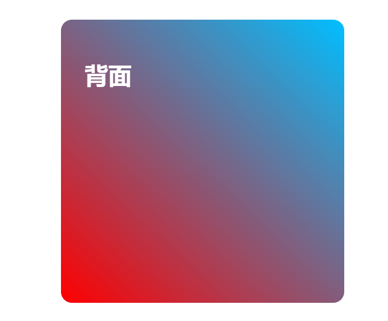
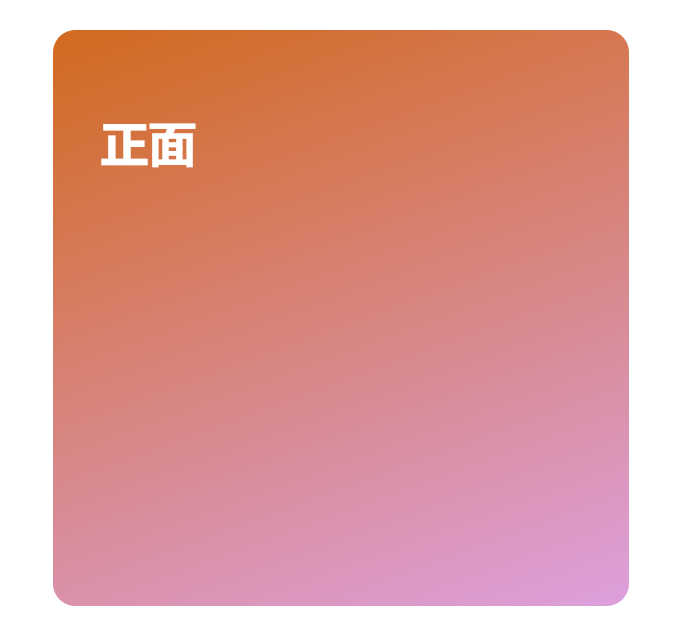

# **琐碎的日常积累**

## **前端**

#### **实现卡片翻转效果**

```html
<!doctype html>
<html lang="en">
<head>
    <meta charset="UTF-8">
    <meta name="viewport"
          content="width=device-width, user-scalable=no, initial-scale=1.0, maximum-scale=1.0, minimum-scale=1.0">
    <meta http-equiv="X-UA-Compatible" content="ie=edge">
    <title>Card Reversal</title>
    <style>
        .card{
            position: relative;
            height: 40rem;
            max-width: 400px;
            margin: 4rem auto;
            perspective: 60rem;
        }

        .card-side{
            height: 20rem;
            border-radius: 15px;
            width: 80%;
            padding: 2rem;
            color: white;
            position: absolute;
            left: 0;
            top: 0;
            backface-visibility: hidden;
            transition: all 0.8s ease;
        }

        .card-side.back{
            transform: rotateY(-180deg);
            background-color: #4158D0;
            background-image: linear-gradient(43deg, red, deepskyblue);
        }
        .card-side.front{
            background-color: #0093E9;
            background-image: linear-gradient(160deg, chocolate, plum);
        }
        .card:hover .card-side.front{
            transform: rotateY(180deg);
        }
        .card:hover .card-side.back{
            transform: rotateY(0deg);
        }
    </style>
</head>
<body>
<div class="card">
    <div class="card-side front">
        <h1>正面</h1>
    </div>
    <div class="card-side back">
        <h1>背面</h1>
    </div>
</div>
</body>
</html>
```



鼠标悬停后 会有反转效果