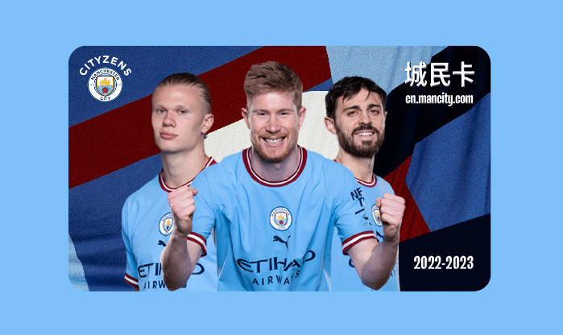
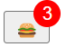

# **琐碎的日常积累**

## **前端**

### **JS相关**

#### **let var const的区别**

使用var关键字声明的全局作用域变量**属于window对象**。

使用let关键字声明的全局作用域变量**不属于window对象**。

使用var关键字声明的变量在**任何地方都可以修改**。

在相同的作用域或块级作用域中，不能使用let关键字来重置var关键字声明的变量。

在相同的作用域或块级作用域中，不能使用let关键字来重置let关键字声明的变量。

let关键字在不同作用域，或不同块级作用域中是可以重新声明赋值的。

在相同的作用域或块级作用域中，不能使用const关键字来重置var和let关键字声明的变量。

在相同的作用域或块级作用域中，不能使用const关键字来重置const关键字声明的变量

const 关键字在不同作用域，或不同块级作用域中是可以重新声明赋值的:

var关键字定义的变量可以先使用后声明。

let关键字定义的变量需要先声明再使用。

const关键字定义的常量，声明时必须进行初始化，且初始化后不可再修改。


### **动画效果**

#### **实现卡片翻转效果**

```html
<!doctype html>
<html lang="en">
<head>
    <meta charset="UTF-8">
    <meta name="viewport"
          content="width=device-width, user-scalable=no, initial-scale=1.0, maximum-scale=1.0, minimum-scale=1.0">
    <meta http-equiv="X-UA-Compatible" content="ie=edge">
    <title>Card Reversal</title>
    <style>
        .card{
            position: relative;
            height: 40rem;
            max-width: 400px;
            margin: 4rem auto;
            perspective: 60rem;
        }

        .card-side{
            height: 20rem;
            border-radius: 15px;
            width: 80%;
            padding: 2rem;
            color: white;
            position: absolute;
            left: 0;
            top: 0;
            backface-visibility: hidden;
            transition: all 0.8s ease;
        }

        .card-side.back{
            transform: rotateY(-180deg);
            background-color: #4158D0;
            background-image: linear-gradient(43deg, red, deepskyblue);
        }
        .card-side.front{
            background-color: #0093E9;
            background-image: linear-gradient(160deg, chocolate, plum);
        }
        .card:hover .card-side.front{
            transform: rotateY(180deg);
        }
        .card:hover .card-side.back{
            transform: rotateY(0deg);
        }
    </style>
</head>
<body>
<div class="card">
    <div class="card-side front">
        <h1>正面</h1>
    </div>
    <div class="card-side back">
        <h1>背面</h1>
    </div>
</div>
</body>
</html>
```


鼠标悬停后 会有反转效果


#### **图片缩放效果**

```html
<!doctype html>
<html lang="en">
<head>
    <meta charset="UTF-8">
    <meta name="viewport"
          content="width=device-width, user-scalable=no, initial-scale=1.0, maximum-scale=1.0, minimum-scale=1.0">
    <meta http-equiv="X-UA-Compatible" content="ie=edge">
    <title>Image Zoom Effect</title>
    <style>
        .outer {
            width: 500px;
            height: 300px;
            background-color: #7ec0f9;
            margin: 0 auto;
            border-radius: 16px;
            position: relative;
        }
        .zoom-wrapper{
            position: absolute;
            top: 50%;
            left: 50%;
            transform: translate(-50%, -50%);
            width: fit-content;
            overflow: hidden;
            border-radius: 16px;
            background-color: #7ec0f9;
        }
        .zoom-wrapper img{
            width: 350px;
            object-fit: cover;
            transition: transform 0.8s;
        }
        .zoom-wrapper:hover img{
            transform: scale(1.1);
        }
    </style>
</head>
<body>
    <div class="outer">
        <div class="zoom-wrapper">
            
        </div>
    </div>
</body>
</html>
```



鼠标悬停图片时，图片会放大


#### **最简方式实现动态标记**

```html
<!doctype html>
<html lang="en">
<head>
    <meta charset="UTF-8">
    <meta name="viewport"
          content="width=device-width, user-scalable=no, initial-scale=1.0, maximum-scale=1.0, minimum-scale=1.0">
    <meta http-equiv="X-UA-Compatible" content="ie=edge">
    <title>Simplest way to implement dynamic markup</title>
    <style>
        body{
            position: relative;
            align-items: center;
            height: 100vh;
        }
        button{
            position: relative;
        }
        button::before{
            content: attr(data-count);
            position: absolute;
            top: -0.75em;
            right: -0.75em;
            width: 1.5em;
            height: 1.5em;
            display: flex;
            justify-content: center;
            align-items: center;
            border-radius: 50%;
            background-color: red;
            color: white;
        }
    </style>
</head>
<body>
    <button data-count="1">🍔</button>
    <script>
        const btn = document.querySelector('[data-count]');
        btn.addEventListener('click', (e)=>{
            e.currentTarget.dataset.count++;
        })
    </script>
</body>
</html>
```



```
const btn = document.querySelector('[data-count]');
```

这一行代码使用 `querySelector()` 方法在文档中选择第一个与提供的 CSS 选择器匹配的元素。在本例中，选择器是 `'[data-count]'`，它将选择第一个具有 `data-count` 属性的元素。选择的元素然后被赋值给 `btn` 常量。

```
btn.addEventListener('click', (e)=>{
```

这一行代码使用 `addEventListener()` 方法在 `btn` 元素上附加一个监听 "click" 事件的事件监听器。第二个参数是一个回调函数，当触发事件时将执行该回调函数。回调函数使用箭头函数定义，并传递一个 "event" 对象（`e`）作为参数。

```
e.currentTarget.dataset.count++;
```

在回调函数中，这一行代码会增加被点击的元素（`e.currentTarget`）的 `dataset` 对象的 `count` 属性的值。`dataset` 对象是一个 DOMStringMap 对象，它提供对元素上设置的所有自定义数据属性（data-*）的读写访问。在本例中，`count` 属性被设置在具有 `data-count` 属性的元素上。

所以，每次点击该元素时，`count` 属性的值都会增加 1。