# 计算机组成原理

# **系统概论**

## **冯诺依曼结构计算机工作原理**

### **工作原理**

存储程序：将程序存储在计算机的存储器中；

程序控制：按指令地址访问存储器并取出指令，经译码依次产生指令执行所需的控制信号，实现对计算机的控制，完成指令的功能。

### 冯诺依曼计算机的组成（硬件+软件）

#### **硬件系统**

##### 运算器

负责算术运算（加减乘除等）、逻辑运算（与或非 位移等）。

基本结构：ALU（Arithmetic Logical unit）、寄存器、连接通路

##### **控制器**

基本功能：产生指令执行过程所需要的所有控制信号，控制相关功能部件执行相应操作

控制信号的形式：电平信号、脉冲信号

产生控制信号的依据：指令、状态、时序

控制信号的产生方式：微程序、硬布线

##### **存储器**

功能：存储原程序、原数据、运算中间结果

工作模式：读/写；

工作原理：按地址访问，读/写数据。

容量--->地址线数量

1K ----> 10

1M ----> 20

1G ----> 30

q：要访问256G的主存空间，至少需要多少地址线？

a：

​	1024Byte(字节)=1kB

​	1024kB=1MB

​	1024MB=1GB

​	1024=2^10^

​	1GB=2^30^B

​	内存容量2^n^字节-->地址总线n根

​	256GB=2^38^字节-->地址总线38根

##### **输入输出设备**

输入设备：向计算机输入数据（键盘、鼠标、网卡、扫描仪等）

输出设备：输出处理结果（显示器、声卡、网卡、打印机等）

#### **软件系统**

对于软件的理解：

- 可运行的思想和内容的数字化

  思想：算法、规律、方法----程序表达

  内容：图形、图像、数据、声音文字等被处理的对象

- 软件的表现形式：程序和数据（以二进制表示的信息）

- 软件的核心：算法

- 系统软件

  操作系统、网络系统、编译系统等

- 支持软件

  开发工具、界面工具等

- 应用软件

  游戏软件、办公软件等

### **计算机的层次结构**

指令集架构层为硬件和软件的分界线

## **计算机系统性能评价**

### **非时间指标**

1. 机器字长：指机器一次能处理的二进制位数

   - 由加法器、寄存器的位数决定；
   - 一般与内部寄存器和位数相等（字长）
   - 字长越长，表示数据的范围就越大，精确度越高；
   - 目前常见的有32位和64位

2. 总线宽度：数据总线一次能并行转送的最大信息的位数

   - 一般指运算器与存储器之间的数据总线位数。
   - 有些计算机内部与外部数据总线宽度不一致
   - 8086、80286、 80386内外数据总线等宽
   - 8088、80386SX 外部总线宽度8位内部总线宽度16位
   - Pentium外总线64位,内总线32位（两条32位流水线）

   

3. 主存容量与存储带宽

   - 主存容量：是指一台计算机主存所包含的存储单元总数。
   - 存储带宽：指单位时间内与主存交换的二进制信息量，常用单位B/S(字节/秒)。（影响存储带宽的指标包括数据位宽和数据传输速率）。

### **时间指标**

#### **主频f/时钟周期T，外频、倍频**

- 主频f：指CPU内核工作的时钟频率，即CPU内数字脉冲信号振荡的速率，与CPU实际的运算能力之间不是唯一的、直接关系

- 时钟周期T：也称节拍周期，是计算机中最基本、最小的时间单位。在一个时钟周期内，CPU仅完成一个最基本的动作；

  > f与T的关系：
  >
  > 互为倒数，f越高，T就越小（f=100MHz时T=10ns， f=1GHz时T=1ns）

- 外频：指CPU（内存）与主板之间同步的时钟频率（系统总线的工作频率）；

- 倍频：CPU主频与外频之间的倍数；

  > 主频=外频×倍频

#### **CPI**

Clock cycles Per Instruction

执行一条指令（平均）需要的时钟周期数（即T周期的个数）

可有多个维度如单条指令CPI、一段程序中所有指令的CPI、指令系统CPI等

IPC（Instruction Per Clock） 每个时钟周期内执行的指令条数（并行）

$$CPI = \frac{ 程序中所有指令的时钟周期数之和}{程序指令总数} = \sum (程序中各类指令的CPI × 程序中该类指令的比列)$$

 

应用举例：

> 某计算机指令系统中各类指令所占比例及CPI如下表所示，求程序的CPI

|   指令类型    | CPI  | 指令比例 |
| :-----------: | :--: | :------: |
|  算术和逻辑   |  1   |   60%    |
|  Load/Store   |  2   |   18%    |
|     转移      |  4   |   12%    |
| Cache缺失访问 |  8   |   10%    |

解：$CPI = 1×60\% + 2×18\% + 4×12\% + 8×10\% = 2.24$

---

#### **MIPS**

Million Instrucitons Per Second

每秒钟CPU能执行的指令总条数（单位：百万秒/条）

$$MIPS = \frac{ 指令条数}{执行时间 × 10^6} 
= \frac{指令条数}{(所有指令CPU时钟周期数之和/f)×10^6}
= \frac{f}{CPI ×10^6}$$

应用举例：

> 某计算机主频为1GHZ，在其上运行的目标代码包含2×10^5^条指令，分4类，各类指令所占比例和各自CPI如下表所示，求程序的MIPS。

|   指令类型    | CPI  | 指令比例 |
| :-----------: | :--: | :------: |
|  算术和逻辑   |  1   |   60%    |
|  Load/Store   |  2   |   18%    |
|     转移      |  4   |   12%    |
| Cache缺失访问 |  8   |   10%    |

解：根据CPU全性能公式：$MIPS = \frac{f}{CPI ×10^6}$

$CPI = 1×60\% + 2×18\% + 4 ×12\% + 8×10\% = 2.24$

$MIPS = \frac{f}{(CPI × 10^6)} = \frac{1×10^9}{(2.24×10^6)} = 446.4$

---

#### **CPU时间**

执行一段程序所需的时间 = （CPU时间 + I/O时间 + 存储访问时间 + 各类排队时延等）。

CPU时间 = 程序中所有指令的时钟周期数之和 × T = 程序中所有指令的时钟周期数之和 / f

CPU时间的计算方法：

- 考虑CPI后的CPU时间

  $$CPU时间=总指令数×\sum_{i=1}^n(CPI_I×\frac{IC_i}{总指令数})×时钟周期时间=总指令数×CPI×T$$

- 考虑MIPS后的CPU时间

  $$MIPS = \frac{指令数量}{指令执行时间 × 10^6}$$

  $$程序的执行时间 t=\frac{指令数量}{MIPS×10^6}$$

应用举例：

> 某计算机主屏为1GHZ，在其上运行的目标代码包含2×10^5^条指令，分4类，各类指令所占比例和各自CPI如下表所示，求该段程序的CPU时间。

|   指令类型    | CPI  | 指令比例 |
| :-----------: | :--: | :------: |
|  算术和逻辑   |  1   |   60%    |
|  Load/Store   |  2   |   18%    |
|     转移      |  4   |   12%    |
| Cache缺失访问 |  8   |   10%    |

方法一：利用CPI

$CPU时间 = 2 × 10^5 × \frac{CPI}{f}= (2 × 10^5× 2.24 \div 10^9) = 4.48 × 10^{-4}(秒)$

ps:主频f和周期T互为倒数

方法二：利用MIPS

$CPU时间 = \frac{指令数量}{MIPS × 10^6} = \frac{2 × 10^5} {\frac{10^3}{2.24} × 10 ^{-4}} = 4.48 ×10^{-4} (秒)$

---

#### **计算机性能指标是确定的吗？**

## **计算机性能测试**

### **CPU测试工具**

- CPUmark：综合CPU测试，包括系统存储，浮点运算和逻辑运算；
- SysID：测试CPU电压，运行频率，L1、L2 Cache以及各项技术资料；
- Hot CPU Tester：可测试机器稳定性，尤其是超频后的稳定性，找出CPU的最高超频点或缺陷，还可检测CPU的详细性能指标并给出量化的分数值。包括「复杂矩阵」「排序算法」「快速傅立叶变换」 「CPU 缓存」「内存」「硬盘」 及指令集等。另外其CPU/Mem Burn-in )还可以作为新购机时的烤机软件来使用。

### **显卡测试工具**

- 3DMark：除衡量显卡性能外，已渐渐转变成一款衡量整机性能的软件，已发行3Dmark99、3Dmark 1 1和The new 3DMark等近10个版本；
- N-Bench2：重点测试CPU以及系统图形性能；
- FurMark：通过皮毛渲染算法来衡量显卡的性能及其稳定性, 提供了全屏/窗口、预定分辨率、基于时间或帧的测试、多种多重采样反锯齿、竞赛等多种模式。

### **硬盘测试工具**

- Hard Disk Speed：硬盘测速软件；
- Disk Benchmark：通过对不同大小的数据块对磁盘读/写速度的影响检测硬盘、U盘、 存储卡及其它可移动磁盘的读/写入速率；
- iometer：可被配置为基准测试程序的磁盘和网络I/O的负载,可测试磁盘和网络控制器的性能、总线带宽和时延等参数；
- HDD Temperature Pro:：盘温度探测软件。

### **内存测试工具**

- CTSPD：选择主板厂商及型号后可详细测试内存的信息，包括：CASlatency (列地址选通时延)、RAS to CAS delay(RAS到CAS的相对延迟时间)、RAS precharge Trp (RAS预充电时间)、 DIMM内存生产厂商和DIMM编号等信息。
- Memory Speed：通过读写不同大小的块状数据来测试内存的性能；
- Memory Transfer Timing Utility：通过对源文件和目标文件进行校正和非校正复制,测试内存的读、写速率；

# **数据表示**

## **机器数及特点**

目的：组织数据，方便计算机硬件直接使用

要考虑的因素：

- 支持的数据类型
- 能表示的数据范围
- 能表示的数据精度
- 存储和处理的代价
- 是否有利于软件的移植等

### **机器内的数据表示**

1. 真指：符号用“+”、“-”表示的数据表示方法
2. 机器数：符号数值化的数据表示方法，用0、1表示符号
3. 设定点整数的形式为X~0~X~1~X~2~X~3~....X~n~

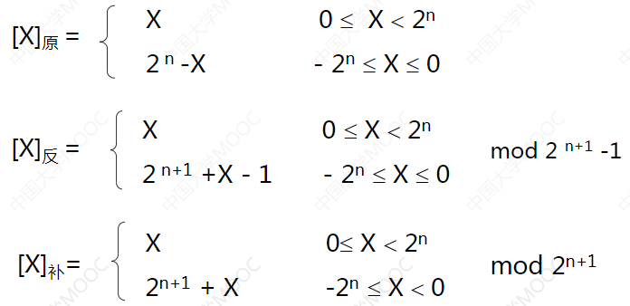

---

以下内容转载自https://www.cnblogs.com/zhangziqiu/archive/2011/03/30/ComputerCode.html

**1、机器数**

一个数在计算机中的二进制表示形式, 叫做这个数的机器数。机器数是带符号的，在计算机用一个数的最高位存放符号, 正数为0, 负数为1.

比如，十进制中的数 +3 ，计算机字长为8位，转换成二进制就是00000011。如果是 -3 ，就是 10000011 。

那么，这里的 00000011 和 10000011 就是机器数。

**2、真值**

> 因为第一位是符号位，所以机器数的形式值就不等于真正的数值。例如上面的有符号数 10000011，其最高位1代表负，其真正数值是 -3 而不是形式值131（10000011转换成十进制等于131）。所以，为区别起见，将带符号位的机器数对应的真正数值称为机器数的真值。

例：0000 0001的真值 = +000 0001 = +1，1000 0001的真值 = –000 0001 = –1

 

**二. 原码, 反码, 补码的基础概念和计算方法.**

在探求为何机器要使用补码之前, 让我们先了解原码, 反码和补码的概念.对于一个数, 计算机要使用一定的编码方式进行存储. 原码, 反码, 补码是机器存储一个具体数字的编码方式.

1. 原码

原码就是符号位加上真值的绝对值, 即用第一位表示符号, 其余位表示值. 比如如果是8位二进制:

> [+1]原 = 0000 0001
>
> [-1]原 = 1000 0001

第一位是符号位. 因为第一位是符号位, 所以8位二进制数的取值范围就是:

> [1111 1111 , 0111 1111]

即

> [-127 , 127]

原码是人脑最容易理解和计算的表示方式.

**2. 反码**

反码的表示方法是:

正数的反码是其本身

负数的反码是在其原码的基础上, 符号位不变，其余各个位取反.

> [+1] = [00000001]原 = [00000001]反
>
> [-1] = [10000001]原 = [11111110]反

可见如果一个反码表示的是负数, 人脑无法直观的看出来它的数值. 通常要将其转换成原码再计算.

**3. 补码**

补码的表示方法是:

正数的补码就是其本身

负数的补码是在其原码的基础上, 符号位不变, 其余各位取反, 最后+1. (即在反码的基础上+1)

> [+1] = [00000001]原 = [00000001]反 = [00000001]补
>
> [-1] = [10000001]原 = [11111110]反 = [11111111]补

对于负数, 补码表示方式也是人脑无法直观看出其数值的. 通常也需要转换成原码在计算其数值.

 

**三. 为何要使用原码, 反码和补码**

在开始深入学习前, 我的学习建议是先"死记硬背"上面的原码, 反码和补码的表示方式以及计算方法.

现在我们知道了计算机可以有三种编码方式表示一个数. 对于正数因为三种编码方式的结果都相同:

> [+1] = [00000001]原 = [00000001]反 = [00000001]补

所以不需要过多解释. 但是对于负数:

> [-1] = [10000001]原 = [11111110]反 = [11111111]补

可见原码, 反码和补码是完全不同的. 既然原码才是被人脑直接识别并用于计算表示方式, 为何还会有反码和补码呢?

首先, 因为人脑可以知道第一位是符号位, 在计算的时候我们会根据符号位, 选择对真值区域的加减. (真值的概念在本文最开头). 但是对于计算机, 加减乘数已经是最基础的运算, 要设计的尽量简单. 计算机辨别"符号位"显然会让计算机的基础电路设计变得十分复杂! 于是人们想出了将符号位也参与运算的方法. 我们知道, 根据运算法则减去一个正数等于加上一个负数, 即: 1-1 = 1 + (-1) = 0 , 所以机器可以只有加法而没有减法, 这样计算机运算的设计就更简单了.

于是人们开始探索 将符号位参与运算, 并且只保留加法的方法. 首先来看原码:

计算十进制的表达式: 1-1=0

> 1 - 1 = 1 + (-1) = [00000001]原 + [10000001]原 = [10000010]原 = -2

如果用原码表示, 让符号位也参与计算, 显然对于减法来说, 结果是不正确的.这也就是为何计算机内部不使用原码表示一个数.

为了解决原码做减法的问题, 出现了反码:

计算十进制的表达式: 1-1=0

> 1 - 1 = 1 + (-1) = [0000 0001]原 + [1000 0001]原= [0000 0001]反 + [1111 1110]反 = [1111 1111]反 = [1000 0000]原 = -0

发现用反码计算减法, 结果的真值部分是正确的. 而唯一的问题其实就出现在"0"这个特殊的数值上. 虽然人们理解上+0和-0是一样的, 但是0带符号是没有任何意义的. 而且会有[0000 0000]原和[1000 0000]原两个编码表示0.

于是补码的出现, 解决了0的符号以及两个编码的问题:

> 1-1 = 1 + (-1) = [0000 0001]原 + [1000 0001]原 = [0000 0001]补 + [1111 1111]补 = [0000 0000]补=[0000 0000]原

这样0用[0000 0000]表示, 而以前出现问题的-0则不存在了.而且可以用[1000 0000]表示-128:

> (-1) + (-127) = [1000 0001]原 + [1111 1111]原 = [1111 1111]补 + [1000 0001]补 = [1000 0000]补

-1-127的结果应该是-128, 在用补码运算的结果中, [1000 0000]补 就是-128. 但是注意因为实际上是使用以前的-0的补码来表示-128, 所以-128并没有原码和反码表示.(对-128的补码表示[1000 0000]补算出来的原码是[0000 0000]原, 这是不正确的)

使用补码, 不仅仅修复了0的符号以及存在两个编码的问题, 而且还能够多表示一个最低数. 这就是为什么8位二进制, 使用原码或反码表示的范围为[-127, +127], 而使用补码表示的范围为[-128, 127].

因为机器使用补码, 所以对于编程中常用到的32位int类型, 可以表示范围是: [-231, 231-1] 因为第一位表示的是符号位.而使用补码表示时又可以多保存一个最小值.

---

### **常见机器数的特点**

1. 原码

   - 表示简单
   - 运算复杂：符号位不参加预算，要设置加法、减法器
   - 0的表示不唯一

2. 反码

   - 表示相对原码复杂
   - 运算相对原码简单：符号位参加运算，只需要设置加法器，但符号位的进位位需要加到最低位
   - 0的表示不唯一

3. 补码

   - 表示相对复杂
   - 运算简单：只需要设置加法器
   - 0的表示唯一

   补码中模的概念：符号位进位所在位的权值

### **移码**

移码表示浮点数的阶码

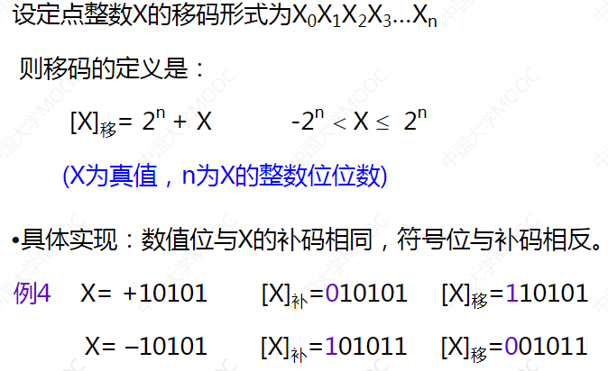

## **定点数与浮点数据表示**

### **定点数据表示**

1. 可表示定点小数和整数
2. 表现形式：$x_0.x_1x_2x_3x_4......x_n$
3. 定点小数表示数的范围（补码为例）：$-1≤x≤1-2^{-n}$
4. 定点整数表示数的范围（补码为例）：$-2^n≤x≤2^n-1$
5. 定点数据表示数的不足：数据表示范围受限

### **浮点数据表示**

#### **格式**

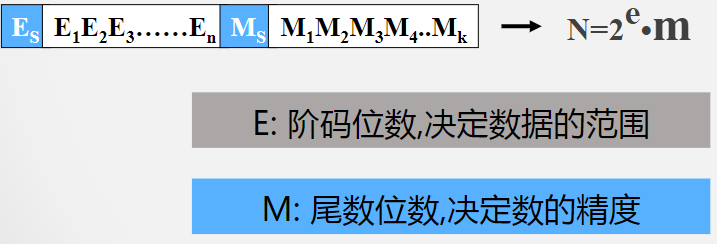

例：将$x=2^{-01}×(-0.1110)$表示成机器形式。假定用8位表示该数，且阶码占3位，位数占5位（均包含一位符号位）

解：假定阶码和尾数均采用补码 111 10010

#### **IEEE754格式**

| s    | 8位偏指数E  | 23位有效尾数M | 单精度 |
| ---- | ----------- | ------------- | ------ |
| s    | 11位偏指数E | 52位有效尾数M | 双精度 |

指数采用偏移值，其中单精度偏移值为127，双精度为1023，将浮点数的阶码值变成非负整数，便于浮点数的比较和排序。

IEEE754尾数形式为1.XXXXXX，其中M部分保存的是XXXXXX（1被隐藏），从而可保留更多的有效位，提高数据表示的精确度。

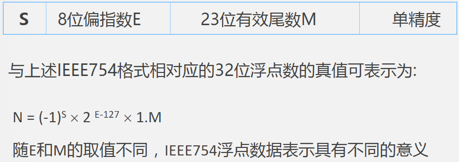

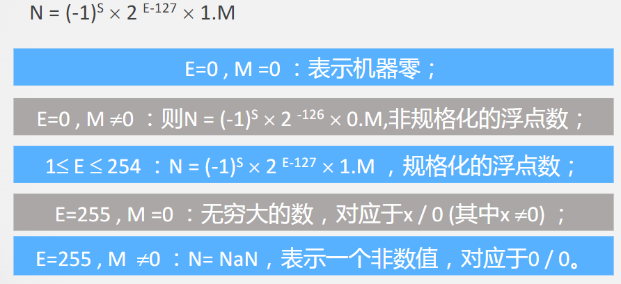

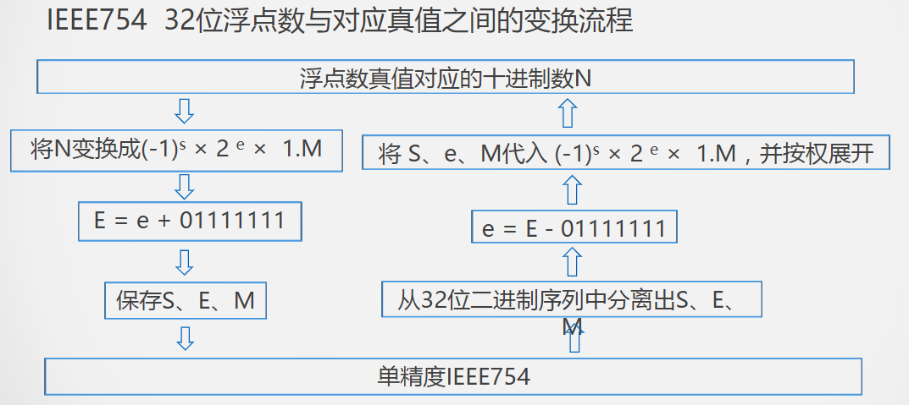

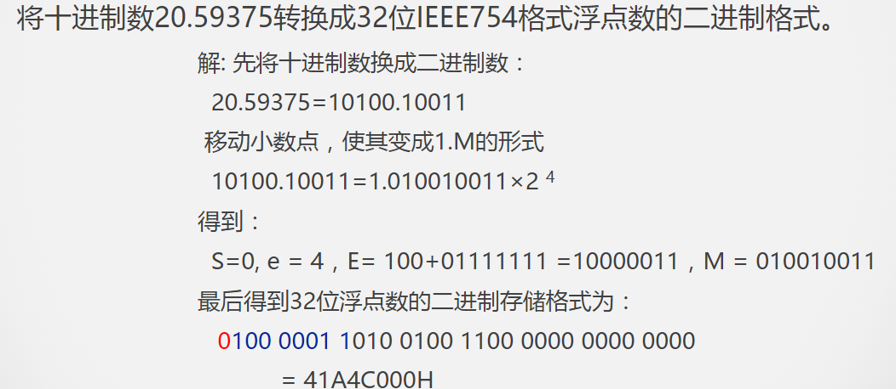

## **数据校验的基本原理**

### **数据校验的必要性**

1. 搜元器件的质量、电路故障或噪音干扰等因素的影响，数据在被处理、传输、存储的过程中可能出现错误
2. 若能设计硬件层面的错误检测机制，可以减少基于软件检错的代价

### **校验的基本原理**

增加冗余码（校验位）

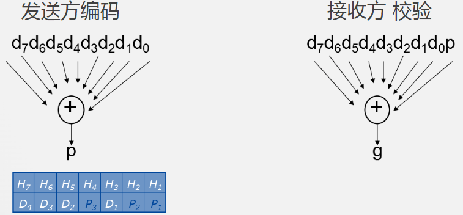

### **码距的概念**

同一编码中，任意两个合法编码之间不同二进制数位数的最小值，也就是两个码组对应位上数字的不同位的个数。

- 0011和0001的码距为1，一位错误时无法识别；
- 0000、0011、0101、0110、1001、1010、1100、1111等编码码距为2.任何一位发生改变，如0000变成1000就从有效编码变成了无效编码，容易检测到这种错误。
- 校验码中增加冗余项的目的就是为了增大码距

### **码距与检错或纠错能力的关系**

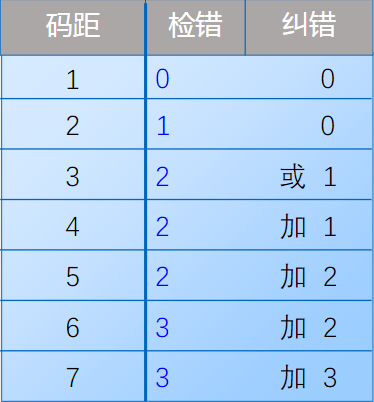

1. 码距≥e+1，可以检测e个错误
2. 码距≥2t+1，可以纠正t个错误
3. 码距≥e+t+1，可以纠正t个错误，同时检测e个错误（e≥t）

### **选择码距要考虑的因素**

- 码距越大，抗干扰能力越强，纠错能力越强,数据冗余越大，编码效率低,编码电路也相对复杂
- 选择码距必须考虑信息发生差错的概率和系统能容许的最小差错率。

## **奇偶校验**

### **奇偶校验基本原理**

1. 增加冗余码（校验位）

   

2. 编码：根据有效信息计算校验信息位，使校验码（数据+1位校验信息）中1的个数满足奇/偶校验的要求

**奇校验：原始码流+校验位 总共有奇数个1**

**偶校验：原始码流+校验位 总共有偶数个1**

### **奇偶校验的特点**

- 编码与检错简单
- 编码效率高
- 不能检测偶数位错误，无错结论不可靠，**是一种错误检测码**
- 不能定位错误，因此不具备纠错能力

关于无错结论不可靠，举个例子：

> 奇校验 正确码流 11000001
>
> **错1位** 11000011 变成了偶数个1，能检测出错误
>
> 错2位 11000010 变成了奇数个1，检测不出错误
>
> **错3位** 11001010 变成了偶数个1，能检测出错误

>偶校验 正确码流 01000001
>
>**错1位** 01000011 变成了奇数个1，能检测出错误
>
>错2位 01000010 变成了偶数个1，检测不出错误
>
>**错3位** 01001010 变成了奇数个1，能检测出错误

**奇偶校验的码距为2**		11000011 -->01000010

### **改进的奇/偶校验**

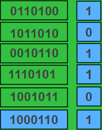

又称双向奇偶校验、方块校验、垂直水平校验

- 可纠正一位错误
- 可检测出某行（列）上的奇数位
- 可检测出一部分偶数位错误
- 不能检测出错码分布在矩形4个顶点上的错误

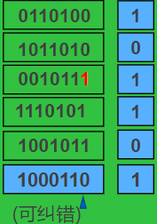

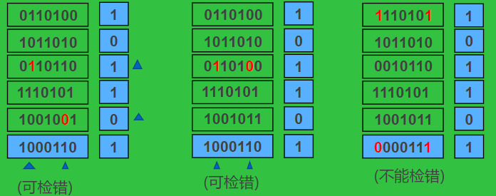

## **CRC校验**

###  **CRC校验的基本原理**

- 增加冗余码（校验位）

  有效信息位K，校验信息位r，则它们之间的关系为$N=k+r≤2^r-1$

- 生成多项式G(x)

  收发双方约定的一个（r+1）位二进制数，发送方利用G(x)对信息多项式做模2除运算，生成校验码。接收双方利用G(x)对收到的编码多项式做模2除运算检测差错及错误定位。

- G(x)应满足的条件

  1. 最高位和最低为必须为1
  2. 当被传送信息（CRC码）任何一位发生错误时，被生成多项式做除后应该使余数不为0
  3. 不同位发送错误时，模2运算后余数不同
  4. 对不为0余数继续进行模2除运算应时余数循环

常见生成多项式G(x):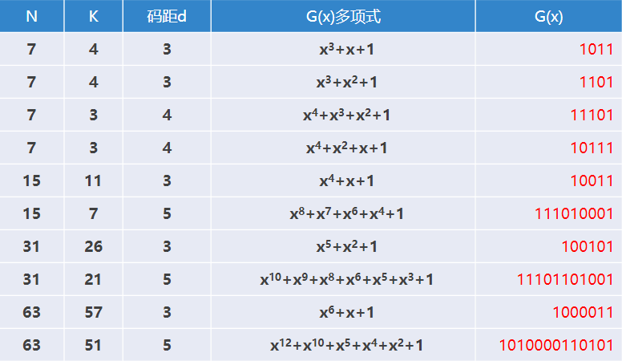

### **模2除运算**

模2除运算规则：

1. 加/减运算（异或运算，加不进位，减不借位）

   0±0=0，0±1=1，1±0=1，1±1=0（其实就是异或运算）

2. 模2除法

   按模2减，求部分余数，不借位

3. 上商原则

   1. 部分余数首位为1时，商为1，减除数
   2. 部分余数首位为0时，商为0，减0
   3. 当部分余数的位数小于除数的位数时，该余数即为最后余数。

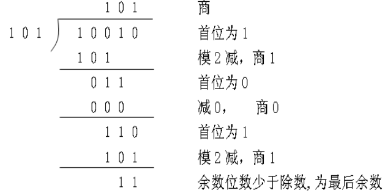

### **CRC编码方法**

1. 根据待校验信息的长度K，按照$N=k+r≤2^r-1$确定校验位r的位数

   eg：对4位信息1100进行CRC编码，$N=4+r≤2^r-1$，得$r_{min}=3$

2. 根据r和生成多项式的选择原则，选择位数为r+1的生成多项式G(x)=1011

3. 进行下列变化

   有效信息（k位）校验信息（r位） ===> 1100000

   即将待校验的二进制信息Q(X)逻辑左移r位，得到Q(X)'

4. 对Q(X)'按模2运算则除G(x)，求CRC编码中的r位校验信息

   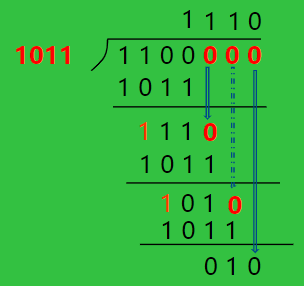

5. 用得到的余数替换Q(X)'的最后r位即可得到对应的CRC编码

   

### **CRC的检错与纠错**

接收方利用G(x)对收到的编码多项式做模2除运算

余数为0说明传输没有错误

接收方利用G(X)对收到的有错编码多项式做模2除运算

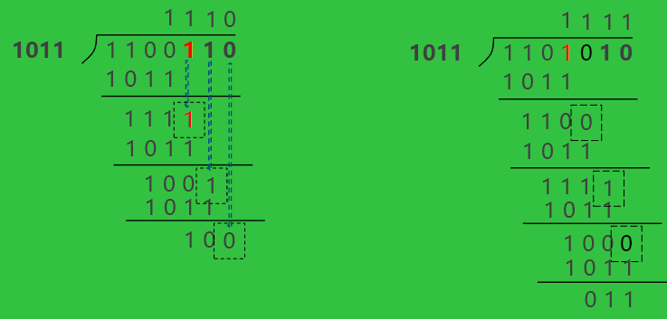

**余数不为0说明传输有错**

- （7，4）编码不同数位出错对应的余数

  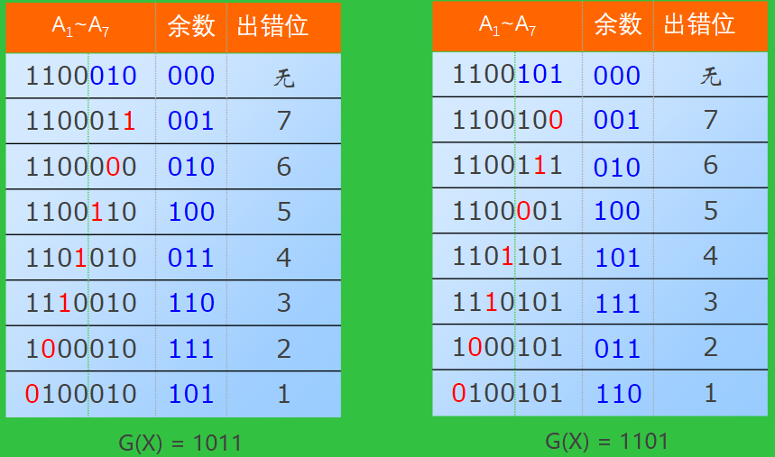

- 一位出错情况下余数的循环特性

  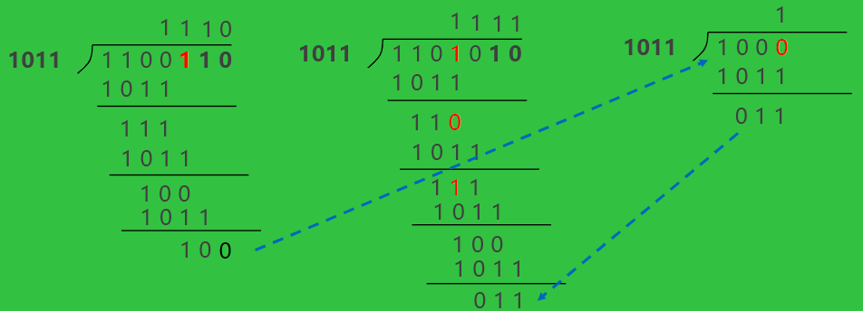

- 利用出错情况下余数的循环特性进行纠错

  若余数不为0，一边对余数补0继续做模2除，同时让被检测的校验码循环左移，当余数为101时，出错位也移到了A1位置。通过异或运算纠正后继续循环左移和执行余数模2除法。

  | 情况说明                                                     | 校验码当前情况 | 运算                | 余数 |
  | ------------------------------------------------------------ | -------------- | ------------------- | ---- |
  | 发现出错，开始纠错                                           | 110001**1**    | 1100011与G(X)模二除 | 001  |
  | 校验码循环左移，同时余数001补0，成为0010，与G(X) 模二除      | 10001**1**1    | 0010与G(X)模二除    | 010  |
  | 校验码循环左移，同时余数010补0，成为0100，与G(X) 模二除      | 0001**1**11    | 0100与G(X)模二除    | 100  |
  | 校验码循环左移，同时余数100补0，成为1000，与G(X) 模二除      | 001**1**110    | 1000与G(X)模二除    | 011  |
  | 校验码循环左移，同时余数011补0，成为0110，与G(X) 模二除      | 01**1**1100    | 0110与G(X)模二除    | 110  |
  | 校验码循环左移，同时余数110补0，成为1100，与G(X) 模二除      | 1**1**11000    | 1100与G(X)模二除    | 111  |
  | 校验码循环左移，同时余数111补0，成为1110，与G(X) 模二除      | **1**110001    | 1110与G(X)模二除    | 101  |
  | 发现当前余数位101，已知101代表第一位出错，把第一位与1进行异或运算(或取反运算)，纠错 | **0**110001    | 无运算              | 无   |
  | 校验码循环左移，同时余数101补0，成为1010，与G(X) 模二除      | 110001**0**    | 1010与G(X)模二除    | 001  |

  此时发现余数已经回到了原来的001，说明循环左移移动了一圈，同时在出错位移动到第一位的时候我们把出错位纠正了，现在原本出错的位置又回到了原来的地方，并且数据也已经更正了。结果为110010与我们的发送的原校验码一致。

## **海明校验**

### **海明校验的基本原理**

增加冗余码（校验位）：有效信息（k位）校验信息（r位）$n=k+r≤2^r-1$

1. 设k+r位海明码从左到右依次为第1，2，3，......，k+r位，r位校验位记为$p_i(i=1,2,...,r)$，分别位于k+r位海明编码的第$2^{i-1}(i=1,2,...r)$位上，其余位依次放置被校验的数据位；

2. （7，4）海明码校验码中校验位和被校验位的排列如下：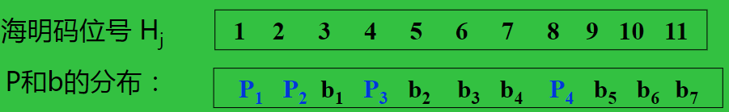

3. $H_j$位的数据被编号小于j的若干个海明位号之和等于j的校验位所校验，如：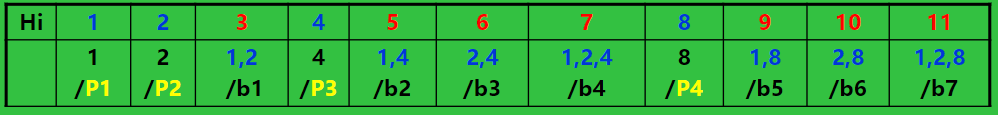

   由此可采用偶校验计算出$p_1-p_4$四个校验位的值

   P1=b1⊕b2⊕b4⊕b5⊕b7

   P2=b1⊕b3⊕b4⊕b6⊕b7

   P3=b2⊕b3⊕b4

   P4=b5⊕b6⊕b7

4. 设置指错字$G_4G_3G_2G_1$

   G4=P4⊕b5⊕b6⊕b7

   G3=P3⊕b2⊕b3⊕b4

   G2=P2⊕b1⊕b3⊕b4⊕b6⊕b7

   G1=P1⊕b1⊕b2⊕b4⊕b5⊕b7

   $G_4G_3G_2G_1$为0则表示无错误，反之指出出错位的海明码位号

### **海明校验编码举例**

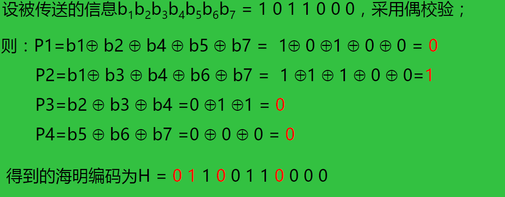

### **海明校验检错与纠错举例**

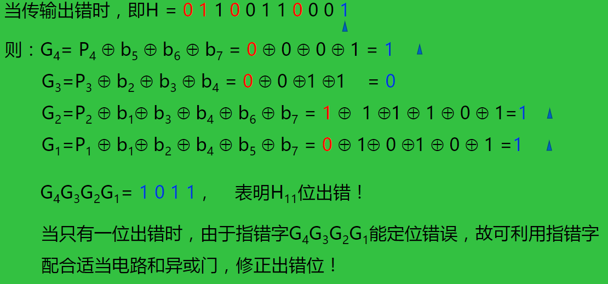

### **海明校验特点分析**

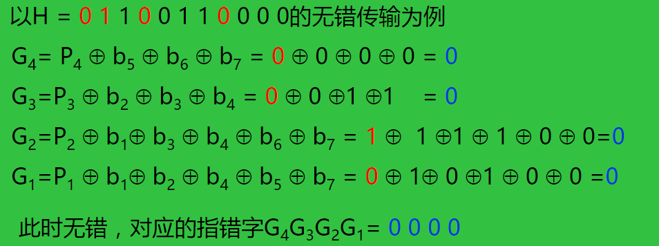

1. 指错字$G_4G_3G_2G_1=0000$不一定无错（利用奇偶校验的特点去判断）

   如P1、b1、P2三位同时出错，则G2和G1依然为0

2. 指错字能区别一位错和两位错码

   如b1、b2同时出错，与仅b3出错时的指错字均为$G_4G_3G_2G_1=0110$

   因此不一定能区别错一位和错两位