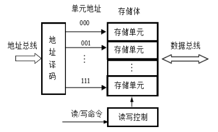

# 计算机组成原理

# **系统概论**

## **冯诺依曼结构计算机工作原理**

### **工作原理**

存储程序：将程序存储在计算机的存储器中；

程序控制：按指令地址访问存储器并取出指令，经译码依次产生指令执行所需的控制信号，实现对计算机的控制，完成指令的功能。

### 冯诺依曼计算机的组成（硬件+软件）

#### **硬件系统**

##### 运算器

负责算术运算（加减乘除等）、逻辑运算（与或非 位移等）。

基本结构：ALU（Arithmetic Logical unit）、寄存器、连接通路

##### **控制器**

基本功能：产生指令执行过程所需要的所有控制信号，控制相关功能部件执行相应操作

控制信号的形式：电平信号、脉冲信号

产生控制信号的依据：指令、状态、时序

控制信号的产生方式：微程序、硬布线

##### **存储器**

功能：存储原程序、原数据、运算中间结果

工作模式：读/写；

工作原理：按地址访问，读/写数据。

容量--->地址线数量

1K ----> 10

1M ----> 20

1G ----> 30

> q：要访问256G的主存空间，至少需要多少地址线？
>
> a：
>
> 1024Byte(字节)=1kB
>
> 1024kB=1MB
>
> 1024MB=1GB
>
> 1024=2^10^
>
> 1GB=2^30^B
>
> 内存容量2^n^字节-->地址总线n根
>
> 256GB=2^38^字节-->地址总线38根

##### **输入输出设备**

输入设备：向计算机输入数据（键盘、鼠标、网卡、扫描仪等）

输出设备：输出处理结果（显示器、声卡、网卡、打印机等）

#### **软件系统**

对于软件的理解：

- 可运行的思想和内容的数字化

  思想：算法、规律、方法----程序表达

  内容：图形、图像、数据、声音文字等被处理的对象

- 软件的表现形式：程序和数据（以二进制表示的信息）

- 软件的核心：算法

- 系统软件

  操作系统、网络系统、编译系统等

- 支持软件

  开发工具、界面工具等

- 应用软件

  游戏软件、办公软件等

### **计算机的层次结构**

指令集架构层为硬件和软件的分界线

## **计算机系统性能评价**

### **非时间指标**

1. 机器字长：指机器一次能处理的二进制位数

   - 由加法器、寄存器的位数决定；
   - 一般与内部寄存器和位数相等（字长）
   - 字长越长，表示数据的范围就越大，精确度越高；
   - 目前常见的有32位和64位

2. 总线宽度：数据总线一次能并行转送的最大信息的位数

   - 一般指运算器与存储器之间的数据总线位数。
   - 有些计算机内部与外部数据总线宽度不一致
   - 8086、80286、 80386内外数据总线等宽
   - 8088、80386SX 外部总线宽度8位内部总线宽度16位
   - Pentium外总线64位,内总线32位（两条32位流水线）

   

3. 主存容量与存储带宽

   - 主存容量：是指一台计算机主存所包含的存储单元总数。
   - 存储带宽：指单位时间内与主存交换的二进制信息量，常用单位B/S(字节/秒)。（影响存储带宽的指标包括数据位宽和数据传输速率）。

### **时间指标**

#### **主频f/时钟周期T，外频、倍频**

- 主频f：指CPU内核工作的时钟频率，即CPU内数字脉冲信号振荡的速率，与CPU实际的运算能力之间不是唯一的、直接关系

- 时钟周期T：也称节拍周期，是计算机中最基本、最小的时间单位。在一个时钟周期内，CPU仅完成一个最基本的动作；

  > f与T的关系：
  >
  > 互为倒数，f越高，T就越小（f=100MHz时T=10ns， f=1GHz时T=1ns）

- 外频：指CPU（内存）与主板之间同步的时钟频率（系统总线的工作频率）；

- 倍频：CPU主频与外频之间的倍数；

  > 主频=外频×倍频

#### **CPI**

Clock cycles Per Instruction

执行一条指令（平均）需要的时钟周期数（即T周期的个数）

可有多个维度如单条指令CPI、一段程序中所有指令的CPI、指令系统CPI等

IPC（Instruction Per Clock） 每个时钟周期内执行的指令条数（并行）

$$CPI = \frac{ 程序中所有指令的时钟周期数之和}{程序指令总数} = \sum (程序中各类指令的CPI × 程序中该类指令的比列)$$

 

应用举例：

> 某计算机指令系统中各类指令所占比例及CPI如下表所示，求程序的CPI

|   指令类型    | CPI  | 指令比例 |
| :-----------: | :--: | :------: |
|  算术和逻辑   |  1   |   60%    |
|  Load/Store   |  2   |   18%    |
|     转移      |  4   |   12%    |
| Cache缺失访问 |  8   |   10%    |

> 解：CPI = 1\*60% + 2\*18% + 4 \*12% + 8\*10% = 2.24

#### **MIPS**

Million Instrucitons Per Second

每秒钟CPU能执行的指令总条数（单位：百万秒/条）

$$MIPS = \frac{ 指令条数}{执行时间 × 10^6} 
= \frac{指令条数}{(所有指令CPU时钟周期数之和/f)×10^6}
= \frac{f}{CPI ×10^6}$$

应用举例：

> 某计算机主频为1GHZ，在其上运行的目标代码包含2×10^5^条指令，分4类，各类指令所占比例和各自CPI如下表所示，求程序的MIPS。

|   指令类型    | CPI  | 指令比例 |
| :-----------: | :--: | :------: |
|  算术和逻辑   |  1   |   60%    |
|  Load/Store   |  2   |   18%    |
|     转移      |  4   |   12%    |
| Cache缺失访问 |  8   |   10%    |

> 解：根据CPU全性能公式：$MIPS = \frac{f}{CPI ×10^6}$
>
> CPI = 1\*60% + 2\*18% + 4 \*12% + 8\*10% = 2.24
>
> MIPS = f/(CPI * 10^6^) = 1\*10^9^/(2.24*10^6^) = 446.4

#### **CPU时间**

执行一段程序所需的时间 = （CPU时间 + I/O时间 + 存储访问时间 + 各类排队时延等）。

CPU时间 = 程序中所有指令的时钟周期数之和 × T = 程序中所有指令的时钟周期数之和 / f

CPU时间的计算方法：

- 考虑CPI后的CPU时间

  $$CPU时间=总指令数×\sum_{i=1}^n(CPI_I×\frac{IC_i}{总指令数})×时钟周期时间=总指令数×CPI×T$$

- 考虑MIPS后的CPU时间

  