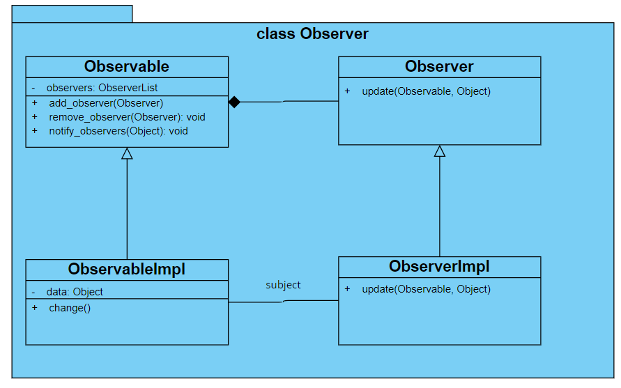

# **设计模式**

[人人都懂设计模式](https://item.jd.com/12580392.html)一书中学习过程中的笔记总结。


## **监听模式**

> 在对象间定义一种一对多的依赖关系，当这个对象状态发生改变时，所有依赖它的对象都会被通知更新。

监听模式又名观察者模式，**属于行为模式**，又叫发布/订阅（Publish/Subscribe）模式、模型/视图模式（Model/View）模式、源/监听（Source/Listener）模式或从属者（Dependents）模式。

举个例子：一款热水器，它拥有洗澡模式和烧开水模式，洗澡模式的水温在50℃~70℃，烧开水模式在100℃，到达相应的温度就会进行提醒。这里的热水器就是被观察者（Observable），洗澡模式和烧开水模式就是观察者（Observer）


### **类图及代码实现**



```python
from abc import ABCMeta, abstractmethod

class Observer(metaclass=ABCMeta):
    """观察者基类"""

    @abstractmethod
    def update(self, observable, object_):
        pass


class Observable:
    """被观察者基类"""

    def __init__(self):
        self.__observers = []

    def add_observer(self, observer):
        self.__observers.append(observer)

    def remove_observer(self, observer):
        self.__observers.remove(observer)

    def notify_observers(self, object_=None):
        for observer in self.__observers:
            observer.update(self, object_)


class WaterHeater(Observable):
    """热水器"""
    def __init__(self):
        super().__init__()
        self.__temperature = 25

    def get_temperature(self):
        return self.__temperature

    def set_temperature(self, temperature):
        self.__temperature = temperature
        print(f'当前温度：{str(self.__temperature)}℃')
        self.notify_observers()


class WashingMode(Observer):
    """洗澡模式"""

    def update(self, observable, object_):
        if isinstance(observable, WaterHeater) and \
            observable.get_temperature() >= 50 and observable.get_temperature() <70:
            print("水烧好了 可以用来洗澡")


class DrinkingMode(Observer):
    """烧水模式"""

    def update(self, observable, object_):
        if isinstance(observable, WaterHeater) and \
            observable.get_temperature() >= 100:
            print('水烧开了 快来喝吧')

if __name__ == '__main__':
    # 测试代码
    heater = WaterHeater()
    washing_obser = WashingMode()
    drinking_obser = DrinkingMode()
    heater.add_observer(washing_obser)
    heater.add_observer(drinking_obser)
    heater.set_temperature(40)
    heater.set_temperature(60)
    heater.set_temperature(100)
```


### **设计要点**

1. 明确观察者和被观察者
2. Observable发送广播通知时无需指定具体的Observer，Observer可以自己决定是否订阅Subject的通知
3. 被观察者至少需要有3个方法：添加观察者、删除观察者、通知观察者。观察者至少要有一个方法：更新方法


### **推模型和拉模型**

监听模式根据其侧重功能还可以分为推模型和拉模型。

推模型：Observable向Observer推送主题的详细信息，不管Observer是否需要，推送的信息通常是主题对象的全部或部分数据。这种模型中，会把Observable对象中的全部或部分信息通过update的参数传递给Observer。

拉模型：Observable在通知Observer时只传递少量信息。如果Observer需要更具体的信息，由Observer到Observable对象中获取。


### **实战应用模拟**

登录异常的检测与提醒

```python
import time

class Account(Observable):
    """用户账号"""

    def __init__(self):
        super(Account, self).__init__()
        self.__last_ip = dict()
        self.__last_region = dict()

    def login(self, name, ip, time):
        region = self.__get_region(ip)
        if self.__is_long_distance(name, region):
            obj_dict = {
                "name": name,
                'ip': ip,
                'region': region,
                'time': time
            }
            self.notify_observers(obj_dict)
        self.__last_region[name] = region
        self.__last_ip[name] = ip

    def __get_region(self, ip):
        """通过ip获取region"""
        ip_regions = {
           '101.47.18.5': '重庆',
           '67.217.61.8': '成都'
        }
        region = ip_regions.get(ip)
        return '' if region is None else region

    def __is_long_distance(self, name, region):
        """模拟地区差异"""
        last_region = self.__last_region.get(name)
        return last_region is not None and last_region != region


class SmsSender(Observer):
    """短信发送"""
    def update(self, observable, object_):
        print(f"短信：{object_['name']} 你好 你的账号可能登录异常 最后一次登录：{object_['ip']} {object_['region']}"
              f"{time.strftime('%Y-%m-%d %H:%M:%S', time.gmtime(object_['time']))}")


class EmailSender(Observer):
    """邮件发送"""
    def update(self, observable, object_):
        print(f"邮件：{object_['name']} 你好 你的账号可能登录异常 最后一次登录：{object_['ip']} {object_['region']}"
              f"{time.strftime('%Y-%m-%d %H:%M:%S', time.gmtime(object_['time']))}")

if __name__ == '__main__':
    account = Account()
    account.add_observer(SmsSender())
    account.add_observer(EmailSender())
    account.login('jayeLiao', '101.47.18.5', time.time())
    account.login('jayeLiao', '67.217.61.8', time.time())
```


### **应用场景**

1. 对一个对象状态或数据的更新需要其他对象同步更新，或者一个对象的更新需要依赖另一个对象的更新。
2. 对象仅需要将自己的更新通知给其他对象而不需要知道其他对象的细节，如消息推送

注意：学习设计模式应该领悟其设计思想而不是局限于代码层面。


## **状态模式**

允许一个对象在其内部状态发生改变时改变其行为，使这个对象看上去就像改变了它的类型一样。

状态即事物所处的某一种形态。状态模式是说一个对象在其内部状态发生改变时，其表现的行为和外在属性不一样，这个对象看上去就像改变了它的类型一样。

举个例子：水拥有固态、液态、气态三种状态


### **类图及代码实现**

以水的三种状态为例


```python
from abc import ABCMeta, abstractmethod

class Context(metaclass=ABCMeta):
    """状态模式上下文环境类"""

    def __init__(self):
        self.__states = []
        self.__cur_state = None

        # 状态发生变化依赖的属性， 当这一变量由多个变量共同决定时可以将其单独定义成一个类
        self.__state_info = 0

    def add_state(self, state):
        if state not in self.__states:
            self.__states.append(state)

    def change_state(self, state):
        if state is None:
            return False
        if self.__cur_state is None:
            print("初始化", state.get_name())
        else:
            print(f"由 {self.__cur_state.get_name()} 变为 {state.get_name()}")
        self.__cur_state = state
        self.add_state(state)
        return True

    def get_state(self):
        return self.__cur_state

    def _set_state_info(self, state_info):
        self.__state_info = state_info
        for state in self.__states:
            if state.is_match(state_info):
                self.change_state(state)

    def _get_state_info(self):
        return self.__state_info


class State:
    """状态的基类"""

    def __init__(self, name):
        self.__name = name

    def get_name(self):
        return self.__name

    @abstractmethod
    def is_match(self, state_info):
        "状态属性state_info 是否在当前状态范围内"
        return False

    @abstractmethod
    def behavior(self, context):
        pass


class Water(Context):
    """水"""

    def __init__(self):
        super().__init__()
        self.add_state(SolidState("固态"))
        self.add_state((LiquidState("液态")))
        self.add_state((GaseousState("气态")))
        self.set_temperature(25)

    def get_temperature(self):
        return self._get_state_info()

    def set_temperature(self, temperature):
        self._set_state_info(temperature)

    def rise_temperature(self, step):
        self.set_temperature(self.get_temperature() + step)

    def reduce_temperature(self, step):
        self.set_temperature(self.get_temperature() - step)

    def behavior(self):
        state = self.get_state()
        if isinstance(state, State):
            state.behavior(self)


# 单例装饰器
def singleton(cls, *args, **kwargs):
    instance = dict()

    def singleton(*args, **kwargs):
        if cls not in instance:
            instance[cls] = cls(*args, **kwargs)
        return instance[cls]
    return singleton


@singleton
class SolidState(State):
    """固态"""

    def __init__(self, name):
        super().__init__(name)

    def is_match(self, state_info):
        return state_info < 0

    def behavior(self, context):
        print(f"当前温度 {context._get_state_info()}℃ 固体")


@singleton
class LiquidState(State):
    """液态"""

    def __init__(self, name):
        super().__init__(name)

    def is_match(self, state_info):
        return state_info >= 0 and state_info < 100

    def behavior(self, context):
        print(f"当前温度 {context._get_state_info()}℃ 液体")


@singleton
class GaseousState(State):
    def __init__(self, name):
        super().__init__(name)

    def is_match(self, state_info):
        return state_info >= 100

    def behavior(self, context):
        print(f"当前温度 {context._get_state_info()}℃ 气体")


if __name__ == '__main__':
    water = Water()
    water.behavior()
    water.set_temperature(-4)
    water.behavior()
    water.rise_temperature(18)
    water.behavior()
    water.rise_temperature(110)
    water.behavior()
```

State是抽象状态类（基类），负责状态的定义和接口的统一。SolidState、GaseousState、LiquidState都是具体的状态类，具体状态类只会有一个实例，不会出现状态1、状态2这些情况，所以状态类的实现要使用单例模式。Context是上下文环境，负责具体状态的切换。


### **设计要点**

1. 在实现状态模式的时候，实现的场景状态有时会非常复杂，决定状态变化的因素非常多，我们可以把决定状态变化的属性单独抽象成一个类StateInfo，这样判断状态属性是否符合当前的状态is_match时就可以传入更多的信息
2. 每一种状态应当只有唯一实例。


### **状态模式的优缺点**

- 优点
  1. 封装了状态的转换规则，在状态模式中可以将状态转换的代码封装在环境类中，对状态转换代码进行集中管理，而不是分散在一个个业务逻辑中。
  2. 将所有与某个状态有关的行为放到一个类中（称为状态类），使开发人员只专注于该状态下的逻辑开发。
  3. 允许状态转换逻辑与状态对象合为一体，使用时只需要注入一个不同的状态对象即可是环境对象拥有不同行为
- 缺点
  - 会增加系统类和对象的个数
  - 状态模式的结构与实现都较为复杂，如果使用不当容易导致程序结构和代码的混乱


### **应用场景**

1. 一个对象的行为取决于它的状态，并且它在运行时可能经常改变它的状态，从而改变它的行为
2. 一个操作中含有庞大的多分支的条件语句，这些分支依赖于该对象的状态，且每一个分支的业务逻辑都非常复杂时，我们可以使用状态模式来拆分不同的分支逻辑，使程序有更好的可读性和可维护性。

